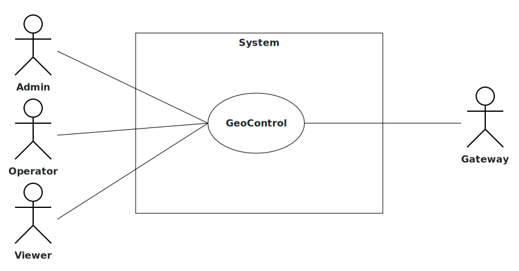

# Requirements Document - GeoControl

Date: 11/04/2025

Version: V1 - description of Geocontrol as described in the swagger

| Version number | Change |
| :------------: | :----: |
|        V1.1        |    Aggiunti i requisiti funzionali e non funzionali    |
|        V1.2        |    Aggiunto: interfacce logiche e fisiche e il deployment diagram   |
|        V1.3        |    Aggiunto: Business Model, Stakeholders, Context Diagram e System Design   |

# Contents

- [Requirements Document - GeoControl](#requirements-document---geocontrol)
- [Contents](#contents)
- [Informal description](#informal-description)
- [Business model](#business-model)
- [Stakeholders](#stakeholders)
- [Context Diagram and interfaces](#context-diagram-and-interfaces)
  - [Context Diagram](#context-diagram)
  - [Interfaces](#interfaces)
- [Stories and personas](#stories-and-personas)
- [Functional and non functional requirements](#functional-and-non-functional-requirements)
  - [Functional Requirements](#functional-requirements)
  - [Non Functional Requirements](#non-functional-requirements)
- [Use case diagram and use cases](#use-case-diagram-and-use-cases)
  - [Use case diagram](#use-case-diagram)
    - [Use case 1, UC1](#use-case-1-uc1)
      - [Scenario 1.1](#scenario-11)
      - [Scenario 1.2](#scenario-12)
      - [Scenario 1.x](#scenario-1x)
    - [Use case 2, UC2](#use-case-2-uc2)
    - [Use case x, UCx](#use-case-x-ucx)
- [Glossary](#glossary)
- [System Design](#system-design)
- [Deployment Diagram](#deployment-diagram)

# Informal description

GeoControl is a software system designed for monitoring physical and environmental variables in various contexts: from hydrogeological analyses of mountain areas to the surveillance of historical buildings, and even the control of internal parameters (such as temperature or lighting) in residential or working environments.

# Business Model
Lo sviluppo e l'operatività sono state finanziate dall'_Unione delle Comunità Montane del Piemonte_, ma già in fase di progettazione si è pensato di sviluppare un software modulare di modo che potesse essere rivenduto ad altri come **One Time Purchase System**. 

Il sistema è venduto come prodotto software isolato da eseguire su un server connesso ad internet, a cui saranno connessi anche i gateway che riceveranno le misurazioni dai sensori ad esso collegati. Gateway e sensori sono forniti già configurati dall'azienda produttrice.

# Stakeholders

| Stakeholder name | Description |
| :--------------: | :---------: |
| Unione delle Comunità Montane del Piemonte | Committente originale |
| Entità destinatarie | Aziende/privati/pubblici interessati al monitoraggio continuo di grandezze fisiche |
| Produttori di sensori/gateway | Aziende produttrici di componenti hardware necessari al funzionamento del sistema |
| Admin | IT admin delle entità destinatarie |
| Operator | IT managers delle entità destinatarie |
| Viewer | Utenti finali interessati alle grandezze fisiche monitorate |

# Context Diagram and interfaces

## Context Diagram

## Interfaces

|   Actor   | Logical Interface | Physical Interface |
| :-------: | :---------------: | :----------------: |
| Admin |GUI e API|Internet|
|Operator|GUI e API|Internet|
|Viewer|GUI e API|Internet|
|Gateway   |API|Internet

# Stories and personas

\<A Persona is a realistic impersonation of an actor. Define here a few personas and describe in plain text how a persona interacts with the system>

\<Persona is-an-instance-of actor>

\<stories will be formalized later as scenarios in use cases>

# Functional and non functional requirements

### **Requisiti Funzionali**

| ID | Descrizione  |
| :---: | :---------- |
| **FR1**  | **Autenticazione** |
| **FR2**  | **Gestione utenti** |
| FR2.1 | Visualizza utenti (uno o tutti) |
| FR2.2 | Crea un nuovo utente |
| FR2.3 | Elimina un utente |
| **FR3**  | **Gestione reti** |
| FR3.1 | Visualizza reti (una o tutte) |
| FR3.2 | Crea una nuova rete |
| FR3.3 | Aggiorna una rete |
| FR3.4 | Elimina una rete |
| **FR4**  | **Gestione gateway nelle reti** |
| FR4.1 | Visualizza i gateway di una rete (uno o tutti) |
| FR4.2 | Crea un nuovo gateway per una rete |
| FR4.3 | Aggiorna un gateway |
| FR4.4 | Elimina un gateway |
| **FR5**  | **Gestione sensori nelle reti** |
| FR5.1 | Visualizza i sensori di un gateway (uno o tutti) |
| FR5.2 | Crea un nuovo sensore per un gateway |
| FR5.3 | Aggiorna un sensore |
| FR5.4 | Elimina un sensore |
| **FR6**  | **Gestire le misurazioni e le statistiche dei sensori** |
| FR6.1 | Recupera le misurazioni per un insieme di sensori di una rete specifica |
| FR6.2 | Recupera solo le statistiche per un insieme di sensori di una rete specifica |
| FR6.3 | Recupera solo le misurazioni anomale per un insieme di sensori di una rete specifica |
| FR6.4 | Memorizza le misurazioni di un sensore |
| FR6.5 | Recupera le misurazioni per un sensore specifico |
| FR6.6 | Recupera le statistiche per un sensore specifico |
| FR6.7 | Recupera solo le misurazioni anomale per un sensore specifico |
| **FR7**  | **Calcoli** |
| FR7.1 | Calcola Media e Varianza |
| FR7.2 | Calcola le Thresholds come: \( \text{sogliaMax} = \mu + 2\sigma \), \( \text{sogliaMin} = \mu - 2\sigma \) |
| FR7.3 | Identifica Outliers considerando i valori oltre le soglie come anomali |
| FR7.4 | Converte fusi orari |

## Requisiti non funzionali

<Describe constraints on functional requirements>

|   ID    | Type | Descrizione | Refers to |
| :-----: | :--------------------------------: | :--------- | :-------: |
|  **NFR1**  | Affidabilità | Non deve perdere più di 6 misurazioni all'anno per sensore | FR6 |
|  **NFR2**  | Sicurezza | Accesso consentito solo ad utenti autorizzati | FR1 |
|  NFR2.1 | Sicurezza | Utente Admin può accedere a: FR1, FR2, FR3, FR4, FR5, FR6 |  |
|  NFR2.2 | Sicurezza | Utente Operator può accedere a FR1, FR3, FR4, FR5, FR6 |  |
|  NFR2.3 | Sicurezza | Utente Viewer può accedere a: FR1, FR3.1, FR4.1, FR5.1, FR6.1, FR6.2, FR6.3, FR 6.5, FR6.6, FR6.7  |  |
|  **NFR3**  | Funzionalità | Le reti devono essere identificate con un codice alfanumerico univoco | FR3 |
|  NFR3.1 | Funzionalità | I gateway sono identificati da un indirizzo MAC | FR4 |
|  NFR3.2 | Funzionalità | I sensori sono identificati da un indirizzo MAC | FR5 |
|  **NFR4**  | Funzionalità | Il sistema deve essere in grado di eseguire calcoli sulle misurazioni raccolte | FR7 |
|  NFR4.1 | Funzionalità | Il sistema converte e memorizza il timestamp nel formato ISO 8601 utilizzando il fuso orario UTC | FR7 |

# Use case diagram and use cases

## Use case diagram

\<define here UML Use case diagram UCD summarizing all use cases, and their relationships>

\<next describe here each use case in the UCD>

### Use case template, UCtemp

| Actors Involved  |                                                                      |
| :--------------: | :------------------------------------------------------------------: |
|   Precondition   | \<Boolean expression, must evaluate to true before the UC can start> |
|  Post condition  |  \<Boolean expression, must evaluate to true after UC is finished>   |
| Nominal Scenario |         \<Textual description of actions executed by the UC>         |
|     Variants     |                      \<other normal executions>                      |
|    Exceptions    |                        \<exceptions, errors >                        |

##### Scenario temp.1

\<describe here scenarios instances of UC1>

\<a scenario is a sequence of steps that corresponds to a particular execution of one use case>

\<a scenario is a more formal description of a story>

\<only relevant scenarios should be described>

|  Scenario temp.1  |                                                                            |
| :------------: | :------------------------------------------------------------------------: |
|  Precondition  | \<Boolean expression, must evaluate to true before the scenario can start> |
| Post condition |  \<Boolean expression, must evaluate to true after scenario is finished>   |
|     Step#      |                                Description                                 |
|       1        |                                                                            |
|       2        |                                                                            |
|      ...       |                                                                            |

##### Scenario temp.2

### Autenticazione, UC1

| Actors Involved  |                                                                      |
| :--------------: | :------------------------------------------------------------------: |
|   Precondition   | \<Boolean expression, must evaluate to true before the UC can start> |
|  Post condition  |  \<Boolean expression, must evaluate to true after UC is finished>   |
| Nominal Scenario |         \<Textual description of actions executed by the UC>         |
|     Variants     |                      \<other normal executions>                      |
|    Exceptions    |                        \<exceptions, errors >                        |

### Visualizza utenti (uno o tutti), UC2

| Actors Involved  |                                                                      |
| :--------------: | :------------------------------------------------------------------: |
|   Precondition   | \<Boolean expression, must evaluate to true before the UC can start> |
|  Post condition  |  \<Boolean expression, must evaluate to true after UC is finished>   |
| Nominal Scenario |         \<Textual description of actions executed by the UC>         |
|     Variants     |                      \<other normal executions>                      |
|    Exceptions    |                        \<exceptions, errors >                        |

### Crea un nuovo utente, UC3

| Actors Involved  |                                                                      |
| :--------------: | :------------------------------------------------------------------: |
|   Precondition   | \<Boolean expression, must evaluate to true before the UC can start> |
|  Post condition  |  \<Boolean expression, must evaluate to true after UC is finished>   |
| Nominal Scenario |         \<Textual description of actions executed by the UC>         |
|     Variants     |                      \<other normal executions>                      |
|    Exceptions    |                        \<exceptions, errors >                        |

### Elimina un utente, UC4

| Actors Involved  |                                                                      |
| :--------------: | :------------------------------------------------------------------: |
|   Precondition   | \<Boolean expression, must evaluate to true before the UC can start> |
|  Post condition  |  \<Boolean expression, must evaluate to true after UC is finished>   |
| Nominal Scenario |         \<Textual description of actions executed by the UC>         |
|     Variants     |                      \<other normal executions>                      |
|    Exceptions    |                        \<exceptions, errors >                        |

### Visualizza reti (una o tutte), UC5

| Actors Involved  |                                                                      |
| :--------------: | :------------------------------------------------------------------: |
|   Precondition   | \<Boolean expression, must evaluate to true before the UC can start> |
|  Post condition  |  \<Boolean expression, must evaluate to true after UC is finished>   |
| Nominal Scenario |         \<Textual description of actions executed by the UC>         |
|     Variants     |                      \<other normal executions>                      |
|    Exceptions    |                        \<exceptions, errors >                        |

### Crea una nuova rete, UC6

| Actors Involved  |                                                                      |
| :--------------: | :------------------------------------------------------------------: |
|   Precondition   | \<Boolean expression, must evaluate to true before the UC can start> |
|  Post condition  |  \<Boolean expression, must evaluate to true after UC is finished>   |
| Nominal Scenario |         \<Textual description of actions executed by the UC>         |
|     Variants     |                      \<other normal executions>                      |
|    Exceptions    |                        \<exceptions, errors >                        |

### Aggiorna una rete, UC7

| Actors Involved  |                                                                      |
| :--------------: | :------------------------------------------------------------------: |
|   Precondition   | \<Boolean expression, must evaluate to true before the UC can start> |
|  Post condition  |  \<Boolean expression, must evaluate to true after UC is finished>   |
| Nominal Scenario |         \<Textual description of actions executed by the UC>         |
|     Variants     |                      \<other normal executions>                      |
|    Exceptions    |                        \<exceptions, errors >                        |

### Elimina una rete, UC8

| Actors Involved  |                                                                      |
| :--------------: | :------------------------------------------------------------------: |
|   Precondition   | \<Boolean expression, must evaluate to true before the UC can start> |
|  Post condition  |  \<Boolean expression, must evaluate to true after UC is finished>   |
| Nominal Scenario |         \<Textual description of actions executed by the UC>         |
|     Variants     |                      \<other normal executions>                      |
|    Exceptions    |                        \<exceptions, errors >                        |

### Visualizza i gateway di una rete (uno o tutti), UC9

| Actors Involved  |                                                                      |
| :--------------: | :------------------------------------------------------------------: |
|   Precondition   | \<Boolean expression, must evaluate to true before the UC can start> |
|  Post condition  |  \<Boolean expression, must evaluate to true after UC is finished>   |
| Nominal Scenario |         \<Textual description of actions executed by the UC>         |
|     Variants     |                      \<other normal executions>                      |
|    Exceptions    |                        \<exceptions, errors >                        |

### Crea un nuovo gateway per una rete, UC10

| Actors Involved  |                                                                      |
| :--------------: | :------------------------------------------------------------------: |
|   Precondition   | \<Boolean expression, must evaluate to true before the UC can start> |
|  Post condition  |  \<Boolean expression, must evaluate to true after UC is finished>   |
| Nominal Scenario |         \<Textual description of actions executed by the UC>         |
|     Variants     |                      \<other normal executions>                      |
|    Exceptions    |                        \<exceptions, errors >                        |

### Aggiorna un gateway, UC11

| Actors Involved  |                                                                      |
| :--------------: | :------------------------------------------------------------------: |
|   Precondition   | \<Boolean expression, must evaluate to true before the UC can start> |
|  Post condition  |  \<Boolean expression, must evaluate to true after UC is finished>   |
| Nominal Scenario |         \<Textual description of actions executed by the UC>         |
|     Variants     |                      \<other normal executions>                      |
|    Exceptions    |                        \<exceptions, errors >                        |

### Elimina un gateway, UC12

| Actors Involved  |                                                                      |
| :--------------: | :------------------------------------------------------------------: |
|   Precondition   | \<Boolean expression, must evaluate to true before the UC can start> |
|  Post condition  |  \<Boolean expression, must evaluate to true after UC is finished>   |
| Nominal Scenario |         \<Textual description of actions executed by the UC>         |
|     Variants     |                      \<other normal executions>                      |
|    Exceptions    |                        \<exceptions, errors >                        |

...

### Visualizza i sensori di un gateway (uno o tutti), UC13

| Actors Involved  |                                                                      |
| :--------------: | :------------------------------------------------------------------: |
|   Precondition   | \<Boolean expression, must evaluate to true before the UC can start> |
|  Post condition  |  \<Boolean expression, must evaluate to true after UC is finished>   |
| Nominal Scenario |         \<Textual description of actions executed by the UC>         |
|     Variants     |                      \<other normal executions>                      |
|    Exceptions    |                        \<exceptions, errors >                        |

### Crea un nuovo sensore per un gateway, UC14

| Actors Involved  |                                                                      |
| :--------------: | :------------------------------------------------------------------: |
|   Precondition   | \<Boolean expression, must evaluate to true before the UC can start> |
|  Post condition  |  \<Boolean expression, must evaluate to true after UC is finished>   |
| Nominal Scenario |         \<Textual description of actions executed by the UC>         |
|     Variants     |                      \<other normal executions>                      |
|    Exceptions    |                        \<exceptions, errors >                        |

### Aggiorna un sensore, UC15

| Actors Involved  |                                                                      |
| :--------------: | :------------------------------------------------------------------: |
|   Precondition   | \<Boolean expression, must evaluate to true before the UC can start> |
|  Post condition  |  \<Boolean expression, must evaluate to true after UC is finished>   |
| Nominal Scenario |         \<Textual description of actions executed by the UC>         |
|     Variants     |                      \<other normal executions>                      |
|    Exceptions    |                        \<exceptions, errors >                        |

### Elimina un sensore, UC16

| Actors Involved  |                                                                      |
| :--------------: | :------------------------------------------------------------------: |
|   Precondition   | \<Boolean expression, must evaluate to true before the UC can start> |
|  Post condition  |  \<Boolean expression, must evaluate to true after UC is finished>   |
| Nominal Scenario |         \<Textual description of actions executed by the UC>         |
|     Variants     |                      \<other normal executions>                      |
|    Exceptions    |                        \<exceptions, errors >                        |

### Recupera le misurazioni per un insieme di sensori di una rete specifica, UC17

| Actors Involved  |                                                                      |
| :--------------: | :------------------------------------------------------------------: |
|   Precondition   | \<Boolean expression, must evaluate to true before the UC can start> |
|  Post condition  |  \<Boolean expression, must evaluate to true after UC is finished>   |
| Nominal Scenario |         \<Textual description of actions executed by the UC>         |
|     Variants     |                      \<other normal executions>                      |
|    Exceptions    |                        \<exceptions, errors >                        |

### Recupera solo le statistiche per un insieme di sensori di una rete specifica, UC18

| Actors Involved  |                                                                      |
| :--------------: | :------------------------------------------------------------------: |
|   Precondition   | \<Boolean expression, must evaluate to true before the UC can start> |
|  Post condition  |  \<Boolean expression, must evaluate to true after UC is finished>   |
| Nominal Scenario |         \<Textual description of actions executed by the UC>         |
|     Variants     |                      \<other normal executions>                      |
|    Exceptions    |                        \<exceptions, errors >                        |

### Recupera solo le misurazioni anomale per un insieme di sensori di una rete specifica, UC19

| Actors Involved  |                                                                      |
| :--------------: | :------------------------------------------------------------------: |
|   Precondition   | \<Boolean expression, must evaluate to true before the UC can start> |
|  Post condition  |  \<Boolean expression, must evaluate to true after UC is finished>   |
| Nominal Scenario |         \<Textual description of actions executed by the UC>         |
|     Variants     |                      \<other normal executions>                      |
|    Exceptions    |                        \<exceptions, errors >                        |

### Memorizza le misurazioni di un sensore, UC20

| Actors Involved  |                                                                      |
| :--------------: | :------------------------------------------------------------------: |
|   Precondition   | \<Boolean expression, must evaluate to true before the UC can start> |
|  Post condition  |  \<Boolean expression, must evaluate to true after UC is finished>   |
| Nominal Scenario |         \<Textual description of actions executed by the UC>         |
|     Variants     |                      \<other normal executions>                      |
|    Exceptions    |                        \<exceptions, errors >                        |

### Recupera le misurazioni per un sensore specifico, UC21

| Actors Involved  |                                                                      |
| :--------------: | :------------------------------------------------------------------: |
|   Precondition   | \<Boolean expression, must evaluate to true before the UC can start> |
|  Post condition  |  \<Boolean expression, must evaluate to true after UC is finished>   |
| Nominal Scenario |         \<Textual description of actions executed by the UC>         |
|     Variants     |                      \<other normal executions>                      |
|    Exceptions    |                        \<exceptions, errors >                        |

### Recupera le statistiche per un sensore specifico, UC22

| Actors Involved  |                                                                      |
| :--------------: | :------------------------------------------------------------------: |
|   Precondition   | \<Boolean expression, must evaluate to true before the UC can start> |
|  Post condition  |  \<Boolean expression, must evaluate to true after UC is finished>   |
| Nominal Scenario |         \<Textual description of actions executed by the UC>         |
|     Variants     |                      \<other normal executions>                      |
|    Exceptions    |                        \<exceptions, errors >                        |

### Recupera solo le misurazioni anomale per un sensore specifico, UC23

| Actors Involved  |                                                                      |
| :--------------: | :------------------------------------------------------------------: |
|   Precondition   | \<Boolean expression, must evaluate to true before the UC can start> |
|  Post condition  |  \<Boolean expression, must evaluate to true after UC is finished>   |
| Nominal Scenario |         \<Textual description of actions executed by the UC>         |
|     Variants     |                      \<other normal executions>                      |
|    Exceptions    |                        \<exceptions, errors >                        |

# Glossary

\<use UML class diagram to define important terms, or concepts in the domain of the application, and their relationships>

\<concepts must be used consistently all over the document, ex in use cases, requirements etc>

# System Design

# Deployment Diagram

