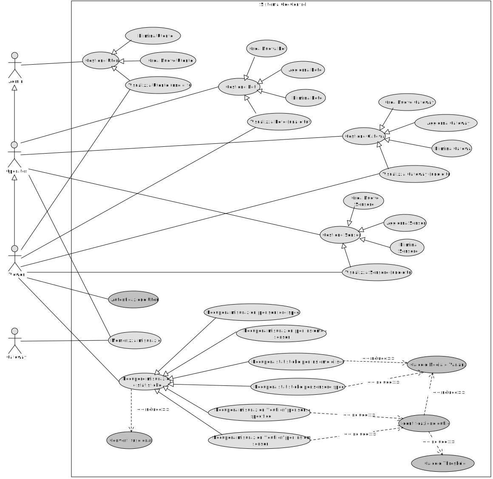
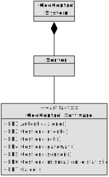
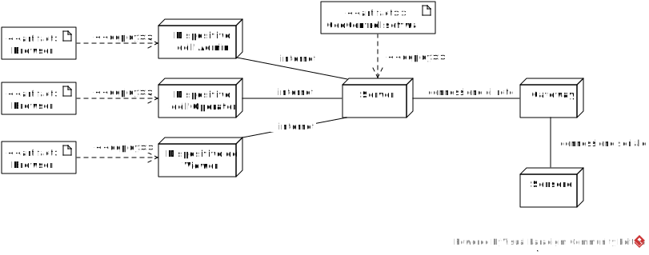

# Requirements Document - GeoControl

Date: 13/04/2025

| Version number | Change |
| :------------: | :----: |
|        V1        |    Description of Geocontrol as described in the swagger   |
|        V1.1        |    Aggiunti i requisiti funzionali e non funzionali    |
|        V1.2        |    Aggiunto: interfacce logiche e fisiche e il deployment diagram   |
|        V1.3        |    Aggiunto: Business Model, Stakeholders, Context Diagram e System Design   |
|        V1.4        |    Aggiunto Use Case Diagram   |
|        V1.5        |    Aggiunte Stories & Personas   |
|        V1.6        |    Aggiunti Use Cases e Scenarios   |
|        V1.7        |    Aggiunto Glossario   |

# Contents

- [Requirements Document - GeoControl](#requirements-document---geocontrol)
- [Contents](#contents)
- [Informal description](#informal-description)
- [Business model](#business-model)
- [Stakeholders](#stakeholders)
- [Context Diagram and interfaces](#context-diagram-and-interfaces)
  - [Context Diagram](#context-diagram)
  - [Interfaces](#interfaces)
- [Stories and personas](#stories-and-personas)
- [Functional and non functional requirements](#functional-and-non-functional-requirements)
  - [Functional Requirements](#functional-requirements)
  - [Non Functional Requirements](#non-functional-requirements)
- [Use case diagram and use cases](#use-case-diagram-and-use-cases)
  - [Use case diagram](#use-case-diagram)
    - [Autenticazione, UC1](#autenticazione-uc1)
    - [Visualizza utenti (uno o tutti), UC2](#visualizza-utenti-uno-o-tutti-uc2)
    - [Crea un nuovo utente, UC3](#crea-un-nuovo-utente-uc3)
    - [Elimina un utente, UC4](#elimina-un-utente-uc4)
    - [Visualizza reti (una o tutte), UC5](#visualizza-reti-una-o-tutte-uc5)
    - [Crea una nuova rete, UC6](#crea-una-nuova-rete-uc6)
    - [Aggiorna una rete, UC7](#aggiorna-una-rete-uc7)
    - [Elimina una rete, UC8](#elimina-una-rete-uc8)
    - [Visualizza i gateway di una rete (uno o tutti), UC9](#visualizza-i-gateway-di-una-rete-uno-o-tutti-uc9)
    - [Crea un nuovo gateway per una rete, UC10](#crea-un-nuovo-gateway-per-una-rete-uc10)
    - [Aggiorna un gateway, UC11](#aggiorna-un-gateway-uc11)
    - [Elimina un gateway, UC12](#elimina-un-gateway-uc12)
    - [Visualizza i sensori di un gateway (uno o tutti), UC13](#visualizza-i-sensori-di-un-gateway-uno-o-tutti-uc13)
    - [Crea un nuovo sensore per un gateway, UC14](#crea-un-nuovo-sensore-per-un-gateway-uc14)
    - [Aggiorna un sensore, UC15](#aggiorna-un-sensore-uc15)
    - [Elimina un sensore, UC16](#elimina-un-sensore-uc16)
    - [Recupera le misurazioni per un insieme di sensori di una rete specifica, UC17](#recupera-le-misurazioni-per-un-insieme-di-sensori-di-una-rete-specifica-uc17)
    - [Recupera solo le statistiche per un insieme di sensori di una rete specifica, UC18](#recupera-solo-le-statistiche-per-un-insieme-di-sensori-di-una-rete-specifica-uc18)
    - [Recupera solo le misurazioni anomale per un insieme di sensori di una rete specifica, UC19](#recupera-solo-le-misurazioni-anomale-per-un-insieme-di-sensori-di-una-rete-specifica-uc19)
    - [Memorizza le misurazioni di un sensore, UC20](#memorizza-le-misurazioni-di-un-sensore-uc20)
    - [Recupera le misurazioni per un sensore specifico, UC21](#recupera-le-misurazioni-per-un-sensore-specifico-uc21)
    - [Recupera le statistiche per un sensore specifico, UC22](#recupera-le-statistiche-per-un-sensore-specifico-uc22)
    - [Recupera solo le misurazioni anomale per un sensore specifico, UC23](#recupera-solo-le-misurazioni-anomale-per-un-sensore-specifico-uc23)
    - [Converti fuso orario, UC24](#converti-fuso-orario-uc24)
    - [Calcola Media e Varianza, UC25](#calcola-media-e-varianza-uc25)
    - [Calcolo Threshold, UC26](#calcolo-threshold-uc26)
    - [Identifica Outlier, UC27](#identifica-outlier-uc27)
- [Glossary](#glossary)
- [System Design](#system-design)
- [Deployment Diagram](#deployment-diagram)

# Informal description

GeoControl is a software system designed for monitoring physical and environmental variables in various contexts: from hydrogeological analyses of mountain areas to the surveillance of historical buildings, and even the control of internal parameters (such as temperature or lighting) in residential or working environments.

# Business Model
Lo sviluppo e l'operatività sono state finanziate dall'_Unione delle Comunità Montane del Piemonte_, ma già in fase di progettazione si è pensato di sviluppare un software modulare di modo che potesse essere rivenduto ad altri come **One Time Purchase System**. 

Il sistema è venduto come prodotto software isolato da eseguire su un server connesso ad internet, a cui saranno connessi anche i gateway che riceveranno le misurazioni dai sensori ad esso collegati. Gateway e sensori sono forniti già configurati dall'azienda produttrice.

# Stakeholders

| Stakeholder name | Description |
| :--------------: | :---------: |
| Unione delle Comunità Montane del Piemonte | Committente originale |
| Entità destinatarie | Aziende/privati/pubblici interessati al monitoraggio continuo di grandezze fisiche |
| Produttori di sensori/gateway | Aziende produttrici di componenti hardware necessari al funzionamento del sistema |
| Admin | IT admin delle entità destinatarie |
| Operator | IT managers delle entità destinatarie |
| Viewer | Utenti finali interessati alle grandezze fisiche monitorate |

# Context Diagram and interfaces

## Context Diagram

## Interfaces

|   Actor   | Logical Interface | Physical Interface |
| :-------: | :---------------: | :----------------: |
| Admin |GUI e API|Internet|
|Operator|GUI e API|Internet|
|Viewer|GUI e API|Internet|
|Gateway   |API|Internet

# Stories and personas

**Giorgio**, 25 anni: Giorgio è un ricercatore scientifico in campo idrogeologico, sta effettuando degli studi in collaborazione con l'Unione delle Comunità Montane del Piemonte, è un utente di tipo *Viewer* ed è interessato alla lettura dei dati e delle misure per scopi di ricerca.

**Silvia**, 47 anni: Silvia lavora per il Museo Egizio di Torino, è un utente di tipo *Admin* e si occupa della gestione delle reti, gateway, sensori e profili utente del sistema GeoControl, utilizzato dal museo per tenere sotto controllo i livelli di umidità e temperatura delle sale.

**Francesca**, 35 anni: Francesca lavora per uno studio di amministrazione condominiale (Studio Amministra-To) e si occupa della manutenzione del sistema GeoControl utilizzato nei condomini amministrati dallo studio per la gestione delle temperature degli alloggi. E' un utente di tipo *Operator* in quanto può gestire le reti, gateway e sensori e anche inserire misure in maniera manuale (ad esempio durante controlli tecnici) ma non ha accesso alle informazioni utente che sono invece gestite dagli amministratori.

**Giuseppe**, 68 anni: Giuseppe è un utente di tipo *Viewer* e utilizza GeoControl per monitorare la temperatura del suo alloggio. Il sistema GeoControl è gestito dallo studio di amministrazione Amministra-To che amministra il condominio.

**Renata**, 55 anni: Renata lavora come amministratore condominiale per lo studio Amministra-To, è un utente di tipo *Admin*.

# Functional and non functional requirements

### **Requisiti Funzionali**

| ID | Descrizione  |
| :---: | :---------- |
| **FR1**  | **Autenticazione** |
| **FR2**  | **Gestione utenti** |
| FR2.1 | Visualizza utenti (uno o tutti) |
| FR2.2 | Crea un nuovo utente |
| FR2.3 | Elimina un utente |
| **FR3**  | **Gestione reti** |
| FR3.1 | Visualizza reti (una o tutte) |
| FR3.2 | Crea una nuova rete |
| FR3.3 | Aggiorna una rete |
| FR3.4 | Elimina una rete |
| **FR4**  | **Gestione gateway nelle reti** |
| FR4.1 | Visualizza i gateway di una rete (uno o tutti) |
| FR4.2 | Crea un nuovo gateway per una rete |
| FR4.3 | Aggiorna un gateway |
| FR4.4 | Elimina un gateway |
| **FR5**  | **Gestione sensori nelle reti** |
| FR5.1 | Visualizza i sensori di un gateway (uno o tutti) |
| FR5.2 | Crea un nuovo sensore per un gateway |
| FR5.3 | Aggiorna un sensore |
| FR5.4 | Elimina un sensore |
| **FR6**  | **Gestire le misurazioni e le statistiche dei sensori** |
| FR6.1 | Recupera le misurazioni per un insieme di sensori di una rete specifica |
| FR6.2 | Recupera solo le statistiche per un insieme di sensori di una rete specifica |
| FR6.3 | Recupera solo le misurazioni anomale per un insieme di sensori di una rete specifica |
| FR6.4 | Memorizza le misurazioni di un sensore |
| FR6.5 | Recupera le misurazioni per un sensore specifico |
| FR6.6 | Recupera le statistiche per un sensore specifico |
| FR6.7 | Recupera solo le misurazioni anomale per un sensore specifico |
| **FR7**  | **Calcoli** |
| FR7.1 | Calcola Media e Varianza |
| FR7.2 | Calcola le Thresholds come: $$ \text{sogliaMax} = \mu + 2\sigma $$ $$ \text{sogliaMin} = \mu - 2\sigma $$ |
| FR7.3 | Identifica Outliers considerando i valori oltre le soglie come anomali |
| FR7.4 | Converte fusi orari |

## Requisiti non funzionali

<Describe constraints on functional requirements>

|   ID    | Type | Descrizione | Refers to |
| :-----: | :--------------------------------: | :--------- | :-------: |
|  **NFR1**  | Affidabilità | Non deve perdere più di 6 misurazioni all'anno per sensore | FR6 |
|  **NFR2**  | Sicurezza | Accesso consentito solo ad utenti autorizzati | FR1 |
|  NFR2.1 | Sicurezza | Utente Admin può accedere a: FR1, FR2, FR3, FR4, FR5, FR6 |  |
|  NFR2.2 | Sicurezza | Utente Operator può accedere a FR1, FR3, FR4, FR5, FR6 |  |
|  NFR2.3 | Sicurezza | Utente Viewer può accedere a: FR1, FR3.1, FR4.1, FR5.1, FR6.1, FR6.2, FR6.3, FR 6.5, FR6.6, FR6.7  |  |
|  **NFR3**  | Funzionalità | Le reti devono essere identificate con un codice alfanumerico univoco | FR3 |
|  NFR3.1 | Funzionalità | I gateway sono identificati da un indirizzo MAC | FR4 |
|  NFR3.2 | Funzionalità | I sensori sono identificati da un indirizzo MAC | FR5 |
|  **NFR4**  | Funzionalità | Il sistema deve essere in grado di eseguire calcoli sulle misurazioni raccolte | FR7 |
|  NFR4.1 | Funzionalità | Il sistema converte e memorizza il timestamp nel formato ISO 8601 utilizzando il fuso orario UTC | FR7 |

# Use case diagram and use cases

## Use case diagram

### Autenticazione, UC1

| **Actors Involved**  | Admin, Operator, Viewer                                          |
| :------------------: | :-------------------------------------------------------------: |
| **Precondition**     | L'utente deve fornire credenziali valide (username e password).  |
| **Post condition**    | L'utente riceve un token bearer per accedere alle funzionalità del sistema. |
| **Nominal Scenario** | L'utente invia credenziali valide e il sistema restituisce un token bearer. |
| **Variants**         | Nessuna variante significativa.                                 |
| **Exceptions**       | - Scenario UC1.2: Credenziali non valide.   - Scenario UC1.3: Errore interno del server.   - Scenario UC1.4: Utente non trovato.   - Scenario UC1.5: Dati di input non validi. |

#### Scenario UC1.1 - Autenticazione con successo

| **Scenario UC1.1**   | Autenticazione con successo.                                     |
| :------------------: | :-------------------------------------------------------------: |
| **Precondition**     | L'utente fornisce credenziali valide.                           |
| **Post condition**   | Il sistema restituisce un token bearer valido.                  |
| **Step#**            | **Descrizione**                                                 |
| 1                    | L'utente invia username e password al sistema.                  |
| 2                    | Il sistema verifica le credenziali.                             |
| 3                    | Il sistema genera un token bearer e lo restituisce all'utente.  |

#### Scenario UC1.2 - Autenticazione fallita per password errata

| **Scenario UC1.2**   | Autenticazione fallita per password errata.                     |
| :------------------: | :-------------------------------------------------------------: |
| **Precondition**     | L'utente esiste ma fornisce una password errata.                |
| **Post condition**   | Il sistema non autentica l'utente e notifica l'errore.          |
| **Step#**            | **Descrizione**                                                 |
| 1                    | L'utente invia username e password al sistema.                  |
| 2                    | Il sistema verifica che la password non è corretta.             |
| 3                    | Il sistema notifica l'errore all'utente.                        |

#### Scenario UC1.3 - Autenticazione fallita per errore interno del server

| **Scenario UC1.3**   | Autenticazione fallita per errore interno del server.           |
| :------------------: | :-------------------------------------------------------------: |
| **Precondition**     | L'utente invia credenziali valide.                              |
| **Post condition**   | Il sistema non autentica l'utente e notifica l'errore.          |
| **Step#**            | **Descrizione**                                                 |
| 1                    | L'utente invia username e password al sistema.                  |
| 2                    | Si verifica un errore interno del server.                       |
| 3                    | Il sistema notifica l'errore all'utente.                  |

#### Scenario UC1.4 - Autenticazione fallita per utente non trovato

| **Scenario UC1.4**   | Autenticazione fallita per utente non trovato.                  |
| :------------------: | :-------------------------------------------------------------: |
| **Precondition**     | L'utente non esiste nel sistema.                                |
| **Post condition**   | Il sistema non autentica l'utente e notifica l'errore.          |
| **Step#**            | **Descrizione**                                                 |
| 1                    | L'utente invia username e password al sistema.                  |
| 2                    | Il sistema verifica che l'utente non esiste.                    |
| 3                    | Il sistema notifica l'errore all'utente.                        |

#### Scenario UC1.5 - Autenticazione fallita per dati di input non validi

| **Scenario UC1.5**   | Autenticazione fallita per dati di input non validi.            |
| :------------------: | :-------------------------------------------------------------: |
| **Precondition**     | L'utente invia dati di input non validi.                        |
| **Post condition**   | Il sistema non autentica l'utente e notifica l'errore.          |
| **Step#**            | **Descrizione**                                                 |
| 1                    | L'utente invia dati di input non validi al sistema.             |
| 2                    | Il sistema rileva che i dati di input non sono validi.          |
| 3                    | Il sistema notifica l'errore all'utente.                  |

---

### Visualizza utenti (uno o tutti), UC2

| **Actors Involved**  | Admin                                                            |
| :------------------: | :-------------------------------------------------------------: |
| **Precondition**     | L'utente deve essere autenticato come Admin.                    |
| **Post condition**    | Il sistema restituisce i dati degli utenti richiesti.          |
| **Nominal Scenario** | L'utente richiede di visualizzare tutti gli utenti e il sistema restituisce i dati richiesti. |
| **Variants**         | - Scenario UC2.2: Utente specifico richiesto. |
| **Exceptions**       | - Scenario UC2.2.1: Utente specifico non trovato.   - Scenario UC2.3: Utente non autorizzato.   - Scenario UC2.4: Errore interno del server. |

#### Scenario UC2.1 - Visualizzazione di tutti gli utenti con successo

| **Scenario UC2.1**   | Visualizzazione di tutti gli utenti con successo.         |
| :------------------: | :-------------------------------------------------------------: |
| **Precondition**     | L'utente è autenticato come Admin.                              |
| **Post condition**    | Il sistema restituisce i dati degli utenti richiesti.          |
| **Step#**            | **Descrizione**                                                 |
| 1                    | L'utente accede alla funzionalità di visualizzazione degli utenti. |
| 2                    | L'utente richiede di visualizzare tutti gli utenti.       |
| 3                    | Il sistema recupera i dati degli utenti da persistenza.           |
| 4                    | Il sistema restituisce i dati degli utenti all'utente.    |

#### Scenario UC2.2 - Visualizzazione di un utente con successo

| **Scenario UC2.2**   | Visualizzazione di un utente con successo.         |
| :------------------: | :-------------------------------------------------------------: |
| **Precondition**     | L'utente è autenticato come Admin.                              |
| **Post condition**    | Il sistema restituisce i dati dell'utente richiesti.          |
| **Step#**            | **Descrizione**                                                 |
| 1                    | L'utente accede alla funzionalità di visualizzazione degli utenti. |
| 2                    | L'utente richiede di visualizzare un utente tramite username.       |
| 3                    | Il sistema recupera i dati dell'utente richiesto da persistenza.           |
| 4                    | Il sistema restituisce i dati dell'utente richiesto all'utente.    |

#### Scenario UC2.2.1 - Visualizzazione fallita per utente non trovato

| **Scenario UC2.2.1**   | Visualizzazione fallita per utente non trovato.         |
| :------------------: | :-------------------------------------------------------------: |
| **Precondition**     | L'utente è autenticato come Admin.                              |
| **Post condition**    | Il sistema non restituisce alcun dato e notifica l'errore.          |
| **Step#**            | **Descrizione**                                                 |
| 1                    | L'utente accede alla funzionalità di visualizzazione degli utenti. |
| 2                    | L'utente richiede di visualizzare un utente tramite username.       |
| 3                    | Il sistema verifica che l'utente non esiste in persistenza.           |
| 4                    | Il sistema notifica l'errore all'utente.    |

#### Scenario UC2.3 - Visualizzazione fallita per utente non autorizzato

| **Scenario UC2.3**   | Visualizzazione fallita per utente non autorizzato.             |
| :------------------: | :-------------------------------------------------------------: |
| **Precondition**     | L'utente non è autenticato o non ha il ruolo di Admin.          |
| **Post condition**    | Il sistema non restituisce alcun dato e notifica l'errore.     |
| **Step#**            | **Descrizione**                                                 |
| 1                    | L'utente tenta di accedere alla funzionalità di visualizzazione degli utenti. |
| 2                    | Il sistema verifica che l'utente non è autorizzato.             |
| 3                    | Il sistema notifica l'errore all'utente.                  |

#### Scenario UC2.4 - Visualizzazione fallita per errore interno del server

| **Scenario UC2.4**   | Visualizzazione fallita per errore interno del server.          |
| :------------------: | :-------------------------------------------------------------: |
| **Precondition**     | L'utente è autenticato come Admin.                              |
| **Post condition**    | Il sistema non restituisce alcun dato e notifica l'errore.     |
| **Step#**            | **Descrizione**                                                 |
| 1                    | L'utente accede alla funzionalità di visualizzazione degli utenti. |
| 2                    | L'utente richiede di visualizzare uno o tutti gli utenti.       |
| 3                    | Si verifica un errore interno del server.                       |
| 4                    | Il sistema notifica l'errore all'utente.                  |

---

### Crea un nuovo utente, UC3

| **Actors Involved**  | Admin                                                            |
| :------------------: | :-------------------------------------------------------------: |
| **Precondition**     | L'utente deve essere autenticato come Admin.                    |
| **Post condition**    | Un nuovo utente viene creato con successo nel sistema.         |
| **Nominal Scenario** | L'utente fornisce i dati richiesti e il sistema crea un nuovo utente. |
| **Variants**         | Nessuna variante significativa.                                 |
| **Exceptions**       | - Scenario UC3.2: Dati mancanti o non validi.   - Scenario UC3.3: Username già in uso.   - Scenario UC3.4: Utente non autorizzato.   - Scenario UC3.5: Permessi insufficienti.   - Scenario UC3.6: Errore interno del server. |

#### Scenario UC3.1 - Creazione di un nuovo utente con successo

| **Scenario UC3.1**   | Creazione di un nuovo utente con successo.                      |
| :------------------: | :-------------------------------------------------------------: |
| **Precondition**     | L'utente è autenticato come Admin.                              |
| **Post condition**    | Un nuovo utente viene creato con successo nel sistema.         |
| **Step#**            | **Descrizione**                                                 |
| 1                    | L'utente accede alla funzionalità di creazione di un nuovo utente. |
| 2                    | L'utente inserisce i dati richiesti: username, password, ruolo. |
| 3                    | Il sistema verifica che i dati siano validi e che l'username non sia già in uso. |
| 4                    | Il sistema salva il nuovo utente in persistenza.                  |
| 5                    | Il sistema conferma la creazione del nuovo utente all'utente.|

#### Scenario UC3.2 - Creazione fallita per dati mancanti o non validi

| **Scenario UC3.2**   | Creazione fallita per dati mancanti o non validi.               |
| :------------------: | :-------------------------------------------------------------: |
| **Precondition**     | L'utente è autenticato come Admin.                              |
| **Post condition**    | Il sistema non crea l'utente e notifica l'errore.              |
| **Step#**            | **Descrizione**                                                 |
| 1                    | L'utente accede alla funzionalità di creazione di un nuovo utente. |
| 2                    | L'utente inserisce dati incompleti o non validi.                |
| 3                    | Il sistema valida i dati forniti dall'utente.                   |
| 4                    | Il sistema rileva che i dati sono incompleti o non validi.      |
| 5                    | Il sistema notifica l'errore all'utente.                  |

#### Scenario UC3.3 - Creazione fallita per username già in uso

| **Scenario UC3.3**   | Creazione fallita per username già in uso.                      |
| :------------------: | :-------------------------------------------------------------: |
| **Precondition**     | L'utente è autenticato come Admin.                              |
| **Post condition**    | Il sistema non crea l'utente e notifica l'errore.              |
| **Step#**            | **Descrizione**                                                 |
| 1                    | L'utente accede alla funzionalità di creazione di un nuovo utente. |
| 2                    | L'utente inserisce i dati richiesti: username, password, ruolo. |
| 3                    | Il sistema verifica che l'username è già in uso.                |
| 4                    | Il sistema notifica l'errore all'utente.                  |

#### Scenario UC3.4 - Creazione fallita per utente non autorizzato

| **Scenario UC3.4**   | Creazione fallita per utente non autorizzato.                   |
| :------------------: | :-------------------------------------------------------------: |
| **Precondition**     | L'utente non è autenticato.                                     |
| **Post condition**    | Il sistema non crea l'utente e notifica l'errore.              |
| **Step#**            | **Descrizione**                                                 |
| 1                    | L'utente tenta di accedere alla funzionalità di creazione di un nuovo utente. |
| 2                    | Il sistema verifica che l'utente non è autenticato.             |
| 3                    | Il sistema notifica l'errore all'utente.                  |

#### Scenario UC3.5 - Creazione fallita per permessi insufficienti

| **Scenario UC3.5**   | Creazione fallita per permessi insufficienti.                   |
| :------------------: | :-------------------------------------------------------------: |
| **Precondition**     | L'utente è autenticato ma non ha il ruolo di Admin.            |
| **Post condition**    | Il sistema non crea l'utente e notifica l'errore.              |
| **Step#**            | **Descrizione**                                                 |
| 1                    | L'utente tenta di accedere alla funzionalità di creazione di un nuovo utente. |
| 2                    | Il sistema verifica che l'utente non ha i permessi necessari.   |
| 3                    | Il sistema notifica l'errore all'utente.                  |

#### Scenario UC3.6 - Creazione fallita per errore interno del server

| **Scenario UC3.6**   | Creazione fallita per errore interno del server.                |
| :------------------: | :-------------------------------------------------------------: |
| **Precondition**     | L'utente è autenticato come Admin.                              |
| **Post condition**    | Il sistema non crea l'utente e notifica l'errore.              |
| **Step#**            | **Descrizione**                                                 |
| 1                    | L'utente accede alla funzionalità di creazione di un nuovo utente. |
| 2                    | L'utente inserisce i dati richiesti: username, password, ruolo. |
| 3                    | Si verifica un errore interno del server.                       |
| 4                    | Il sistema notifica l'errore all'utente.                  |

---

### Elimina un utente, UC4

| **Actors Involved**  | Admin                                                            |
| :------------------: | :-------------------------------------------------------------: |
| **Precondition**     | L'utente deve essere autenticato come Admin.                    |
| **Post condition**    | L'utente specificato viene eliminato dal sistema.              |
| **Nominal Scenario** | L'utente fornisce il nome dell'utente da eliminare e il sistema lo elimina. |
| **Variants**         | Nessuna variante significativa.                                 |
| **Exceptions**       | - Scenario UC4.2: Utente non trovato.   - Scenario UC4.3: Utente non autorizzato.   - Scenario UC4.4: Permessi insufficienti.   - Scenario UC4.5: Errore interno del server. |

#### Scenario UC4.1 - Eliminazione di un utente con successo

| **Scenario UC4.1**   | Eliminazione di un utente con successo.                         |
| :------------------: | :-------------------------------------------------------------: |
| **Precondition**     | L'utente è autenticato come Admin.                              |
| **Post condition**    | L'utente specificato viene eliminato dal sistema.              |
| **Step#**            | **Descrizione**                                                 |
| 1                    | L'utente accede alla funzionalità di eliminazione di un utente. |
| 2                    | L'utente specifica il nome dell'utente da eliminare.            |
| 3                    | Il sistema verifica che l'utente esiste in persistenza.           |
| 4                    | Il sistema elimina l'utente da persistenza.                       |
| 5                    | Il sistema conferma l'eliminazione all'utente.            |

#### Scenario UC4.2 - Eliminazione fallita per utente non trovato

| **Scenario UC4.2**   | Eliminazione fallita per utente non trovato.                    |
| :------------------: | :-------------------------------------------------------------: |
| **Precondition**     | L'utente è autenticato come Admin.                              |
| **Post condition**    | Il sistema non elimina alcun utente e notifica l'errore.       |
| **Step#**            | **Descrizione**                                                 |
| 1                    | L'utente accede alla funzionalità di eliminazione di un utente. |
| 2                    | L'utente specifica il nome dell'utente da eliminare.            |
| 3                    | Il sistema verifica che l'utente non esiste in persistenza.       |
| 4                    | Il sistema notifica l'errore all'utente.                  |

#### Scenario UC4.3 - Eliminazione fallita per utente non autorizzato

| **Scenario UC4.3**   | Eliminazione fallita per utente non autorizzato.                |
| :------------------: | :-------------------------------------------------------------: |
| **Precondition**     | L'utente non è autenticato.                                     |
| **Post condition**    | Il sistema non elimina alcun utente e notifica l'errore.       |
| **Step#**            | **Descrizione**                                                 |
| 1                    | L'utente tenta di accedere alla funzionalità di eliminazione di un utente. |
| 2                    | Il sistema verifica che l'utente non è autenticato.             |
| 3                    | Il sistema notifica l'errore all'utente.                  |

#### Scenario UC4.4 - Eliminazione fallita per permessi insufficienti

| **Scenario UC4.4**   | Eliminazione fallita per permessi insufficienti.                |
| :------------------: | :-------------------------------------------------------------: |
| **Precondition**     | L'utente è autenticato ma non ha il ruolo di Admin.            |
| **Post condition**    | Il sistema non elimina alcun utente e notifica l'errore.       |
| **Step#**            | **Descrizione**                                                 |
| 1                    | L'utente tenta di accedere alla funzionalità di eliminazione di un utente. |
| 2                    | Il sistema verifica che l'utente non ha i permessi necessari.   |
| 3                    | Il sistema notifica l'errore all'utente.                  |

#### Scenario UC4.5 - Eliminazione fallita per errore interno del server

| **Scenario UC4.5**   | Eliminazione fallita per errore interno del server.             |
| :------------------: | :-------------------------------------------------------------: |
| **Precondition**     | L'utente è autenticato come Admin.                              |
| **Post condition**    | Il sistema non elimina alcun utente e notifica l'errore.       |
| **Step#**            | **Descrizione**                                                 |
| 1                    | L'utente accede alla funzionalità di eliminazione di un utente. |
| 2                    | L'utente specifica il nome dell'utente da eliminare.            |
| 3                    | Si verifica un errore interno del server.                       |
| 4                    | Il sistema notifica l'errore all'utente.                  |

---

### Visualizza reti (una o tutte), UC5

| **Actors Involved**  | Admin, Operator, Viewer                                          |
| :------------------: | :-------------------------------------------------------------: |
| **Precondition**     | L'utente deve essere autenticato.                               |
| **Post condition**    | L'utente visualizza le reti richieste.                         |
| **Nominal Scenario** | L'utente richiede di visualizzare tutte le reti e il sistema restituisce i dati richiesti. |
| **Variants**         | - Scenario UC5.2: Rete specifica richiesta.                                 |
| **Exceptions**       | - Scenario UC5.2.1: Rete specifica non trovata.   - Scenario UC5.3: Utente non autenticato.   - Scenario UC5.4: Errore interno del server. |

#### Scenario UC5.1 - Visualizzazione di tutte le reti con successo

| **Scenario UC5.1**   | Visualizzazione di tutte le reti con successo.            |
| :------------------: | :-------------------------------------------------------------: |
| **Precondition**     | L'utente è autenticato come Admin, Operator o Viewer.           |
| **Post condition**    | Il sistema restituisce le reti richieste.                      |
| **Step#**            | **Descrizione**                                                 |
| 1                    | L'utente accede alla funzionalità di visualizzazione delle reti. |
| 2                    | L'utente richiede di visualizzare tutte le reti. |
| 3                    | Il sistema recupera i dati delle reti richieste da persistenza.   |
| 4                    | Il sistema restituisce i dati delle reti all'utente.      |

#### Scenario UC5.2 - Visualizzazione di una rete con successo

| **Scenario UC5.2**   | Visualizzazione di una rete con successo.            |
| :------------------: | :-------------------------------------------------------------: |
| **Precondition**     | L'utente è autenticato come Admin, Operator o Viewer.           |
| **Post condition**    | Il sistema restituisce la rete richiesta.                      |
| **Step#**            | **Descrizione**                                                 |
| 1                    | L'utente accede alla funzionalità di visualizzazione delle reti. |
| 2                    | L'utente richiede di visualizzare una rete specifica tramite codice identificativo. |
| 3                    | Il sistema recupera i dati della rete richiesta da persistenza.   |
| 4                    | Il sistema restituisce i dati della rete all'utente.      |

#### Scenario UC5.2.1 - Visualizzazione fallita per rete non trovata

| **Scenario UC5.2.1**   | Visualizzazione fallita per rete non trovata.            |
| :------------------: | :-------------------------------------------------------------: |
| **Precondition**     | L'utente è autenticato come Admin, Operator o Viewer.           |
| **Post condition**    | Il sistema non restituisce alcuna rete e notifica l'errore.                      |
| **Step#**            | **Descrizione**                                                 |
| 1                    | L'utente accede alla funzionalità di visualizzazione delle reti. |
| 2                    | L'utente richiede di visualizzare una rete specifica tramite codice identificativo. |
| 3                    | Il sistema verifica che la rete non esiste in persistenza.   |
| 4                    | Il sistema notifica l'errore all'utente.      |

#### Scenario UC5.3 - Visualizzazione fallita per utente non autenticato

| **Scenario UC5.3**   | Visualizzazione fallita per utente non autenticato.             |
| :------------------: | :-------------------------------------------------------------: |
| **Precondition**     | L'utente non è autenticato.                                     |
| **Post condition**    | Il sistema non restituisce alcuna rete e notifica l'errore.    |
| **Step#**            | **Descrizione**                                                 |
| 1                    | L'utente tenta di accedere alla funzionalità di visualizzazione delle reti. |
| 2                    | Il sistema verifica che l'utente non è autenticato.             |
| 3                    | Il sistema notifica l'errore all'utente.                  |

#### Scenario UC5.4 - Visualizzazione fallita per errore interno del server

| **Scenario UC5.4**   | Visualizzazione fallita per errore interno del server.          |
| :------------------: | :-------------------------------------------------------------: |
| **Precondition**     | L'utente è autenticato come Admin, Operator o Viewer.           |
| **Post condition**    | Il sistema non restituisce alcuna rete e notifica l'errore.    |
| **Step#**            | **Descrizione**                                                 |
| 1                    | L'utente accede alla funzionalità di visualizzazione delle reti. |
| 2                    | L'utente richiede di visualizzare una rete specifica o tutte le reti. |
| 3                    | Si verifica un errore interno del server durante il recupero dei dati. |
| 4                    | Il sistema notifica l'errore all'utente.                  |

---

### Crea una nuova rete, UC6

| **Actors Involved**  | Admin, Operator                                                  |
| :------------------: | :-------------------------------------------------------------: |
| **Precondition**     | L'utente deve essere autenticato e avere il ruolo di Admin o Operator. |
| **Post condition**    | Una nuova rete viene creata con un codice univoco e memorizzata nel sistema. |
| **Nominal Scenario** | L'utente fornisce i dati richiesti (codice, nome, descrizione) e il sistema crea la rete. |
| **Variants**         | - Scenario UC6.2: Dati superflui allegati.                                 |
| **Exceptions**       | - Scenario UC6.3: Codice rete già esistente.   - Scenario UC6.4: Dati mancanti o non validi.   - Scenario UC6.5: Utente non autenticato.   - Scenario UC6.6: Permessi insufficienti.   - Scenario UC6.7: Errore interno del server. |

#### Scenario UC6.1 - Creazione di una rete con dati validi

| **Scenario UC6.1**   | Creazione di una rete con dati validi.                           |
| :------------------: | :-------------------------------------------------------------: |
| **Precondition**     | L'utente è autenticato come Admin o Operator.                   |
| **Post condition**    | La rete viene creata con successo e memorizzata nel sistema.    |
| **Step#**            | **Descrizione**                                                 |
| 1                    | L'utente accede alla funzionalità di creazione di una nuova rete. |
| 2                    | L'utente inserisce i dati richiesti: codice, nome, descrizione. |
| 3                    | Il sistema verifica che il codice della rete sia univoco.       |
| 4                    | Il sistema salva la rete in persistenza.                          |
| 5                    | Il sistema conferma la creazione della rete all'utente.   |

#### Scenario UC6.2 - Creazione di una rete con dati superflui allegati

| **Scenario UC6.2**   | Creazione di una rete con dati superflui allegati.                           |
| :------------------: | :-------------------------------------------------------------: |
| **Precondition**     | L'utente è autenticato come Admin o Operator.                   |
| **Post condition**    | La rete viene creata con successo e memorizzata nel sistema; i dati superflui sono stati ignorati.    |
| **Step#**            | **Descrizione**                                                 |
| 1                    | L'utente accede alla funzionalità di creazione di una nuova rete. |
| 2                    | L'utente inserisce i dati richiesti: codice, nome, descrizione, oltre che dati su Gateway o Sensori contenuti nella rete. |
| 3                    | Il sistema verifica che il codice della rete sia univoco.       |
| 4                    | Il sistema salva la rete in persistenza, ignorando i dati su Gateway e Sensori.                          |
| 5                    | Il sistema conferma la creazione della rete all'utente.   |

#### Scenario UC6.3 - Creazione fallita per codice rete duplicato

| **Scenario UC6.3**   | Creazione fallita per codice rete duplicato.                     |
| :------------------: | :-------------------------------------------------------------: |
| **Precondition**     | L'utente è autenticato come Admin o Operator.                   |
| **Post condition**    | La rete non viene creata e il sistema notifica l'errore.       |
| **Step#**            | **Descrizione**                                                 |
| 1                    | L'utente accede alla funzionalità di creazione di una nuova rete. |
| 2                    | L'utente inserisce i dati richiesti: codice, nome, descrizione. |
| 3                    | Il sistema verifica che il codice della rete sia univoco.       |
| 4                    | Il sistema rileva che il codice è già in uso.                   |
| 5                    | Il sistema notifica l'errore all'utente.                  |

#### Scenario UC6.4 - Creazione fallita per dati mancanti o non validi

| **Scenario UC6.4**   | Creazione fallita per dati mancanti o non validi.                |
| :------------------: | :-------------------------------------------------------------: |
| **Precondition**     | L'utente è autenticato come Admin o Operator.                   |
| **Post condition**    | La rete non viene creata e il sistema notifica l'errore.       |
| **Step#**            | **Descrizione**                                                 |
| 1                    | L'utente accede alla funzionalità di creazione di una nuova rete. |
| 2                    | L'utente inserisce dati incompleti o non validi.                |
| 3                    | Il sistema valida i dati forniti dall'utente.                   |
| 4                    | Il sistema rileva che i dati sono incompleti o non validi.      |
| 5                    | Il sistema notifica l'errore all'utente.                  |

#### Scenario UC6.5 - Creazione fallita per utente non autenticato

| **Scenario UC6.5** | Creazione fallita per utente non autenticato.                   |
| :------------------: | :-------------------------------------------------------------: |
| **Precondition**     | L'utente non è autenticato.                                     |
| **Post condition**    | La rete non viene creata e il sistema notifica l'errore.       |
| **Step#**            | **Descrizione**                                                 |
| 1                    | L'utente tenta di accedere alla funzionalità di creazione di una nuova rete. |
| 2                    | Il sistema verifica che l'utente non è autenticato.             |
| 3                    | Il sistema notifica l'errore all'utente.                  |

#### Scenario UC6.6 - Creazione fallita per permessi insufficienti

| **Scenario UC6.6** | Creazione fallita per permessi insufficienti.                   |
| :------------------: | :-------------------------------------------------------------: |
| **Precondition**     | L'utente è autenticato ma non ha il ruolo richiesto.            |
| **Post condition**    | La rete non viene creata e il sistema notifica l'errore.       |
| **Step#**            | **Descrizione**                                                 |
| 1                    | L'utente tenta di accedere alla funzionalità di creazione di una nuova rete. |
| 2                    | Il sistema verifica che l'utente non ha i permessi necessari.   |
| 3                    | Il sistema notifica l'errore all'utente.                  |

#### Scenario UC6.7 - Creazione fallita per errore interno del server

| **Scenario UC6.7**   | Creazione fallita per errore interno del server.                |
| :------------------: | :-------------------------------------------------------------: |
| **Precondition**     | L'utente è autenticato come Admin o Operator.                   |
| **Post condition**    | La rete non viene creata e il sistema notifica l'errore.       |
| **Step#**            | **Descrizione**                                                 |
| 1                    | L'utente accede alla funzionalità di creazione di una nuova rete. |
| 2                    | L'utente inserisce i dati richiesti: codice, nome, descrizione. |
| 3                    | Il sistema tenta di salvare la rete in persistenza.               |
| 4                    | Si verifica un errore interno del server.                       |
| 5                    | Il sistema notifica l'errore all'utente.                  |

---

### Aggiorna una rete, UC7

| **Actors Involved**  | Admin, Operator                                                  |
| :------------------: | :-------------------------------------------------------------: |
| **Precondition**     | L'utente deve essere autenticato e avere il ruolo di Admin o Operator. |
| **Post condition**    | La rete specificata viene aggiornata con i nuovi dati forniti. |
| **Nominal Scenario** | L'utente fornisce i dati aggiornati per una rete esistente e il sistema li salva. |
| **Variants**         | - Scenario UC7.2: Dati superflui allegati.                                 |
| **Exceptions**       | - Scenario UC7.3: Dati mancanti o non validi.   - Scenario UC7.4: Utente non autorizzato.   - Scenario UC7.5: Permessi insufficienti.   - Scenario UC7.6: Rete non trovata.   - Scenario UC7.7: Codice rete già in uso.   - Scenario UC7.8: Errore interno del server. |

#### Scenario UC7.1 - Aggiornamento di una rete con successo

| **Scenario UC7.1**   | Aggiornamento di una rete con successo.                          |
| :------------------: | :-------------------------------------------------------------: |
| **Precondition**     | L'utente è autenticato come Admin o Operator.                   |
| **Post condition**    | La rete viene aggiornata con i nuovi dati forniti.             |
| **Step#**            | **Descrizione**                                                 |
| 1                    | L'utente accede alla funzionalità di aggiornamento di una rete. |
| 2                    | L'utente fornisce i dati aggiornati: codice, nome, descrizione. |
| 3                    | Il sistema verifica che i dati siano validi.                    |
| 4                    | Il sistema salva i nuovi dati della rete in persistenza.          |
| 5                    | Il sistema conferma l'aggiornamento della rete all'utente.|

#### Scenario UC7.2 - Aggiornamento di una rete con dati superflui allegati

| **Scenario UC7.2**   | Aggiornamento di una rete con dati superflui allegati.                          |
| :------------------: | :-------------------------------------------------------------: |
| **Precondition**     | L'utente è autenticato come Admin o Operator.                   |
| **Post condition**    | La rete viene aggiornata con i nuovi dati forniti.             |
| **Step#**            | **Descrizione**                                                 |
| 1                    | L'utente accede alla funzionalità di aggiornamento di una rete. |
| 2                    | L'utente fornisce i dati aggiornati: codice, nome, descrizione, oltre che dati su Gateway o Sensori contenuti nella rete. |
| 3                    | Il sistema verifica che i dati siano validi.                    |
| 4                    | Il sistema salva i nuovi dati della rete in persistenza, ignorando quelli su Gateway e Sensori.          |
| 5                    | Il sistema conferma l'aggiornamento della rete all'utente.|

#### Scenario UC7.3 - Aggiornamento fallito per dati mancanti o non validi

| **Scenario UC7.3**   | Aggiornamento fallito per dati mancanti o non validi.           |
| :------------------: | :-------------------------------------------------------------: |
| **Precondition**     | L'utente è autenticato come Admin o Operator.                   |
| **Post condition**    | La rete non viene aggiornata e il sistema notifica l'errore.   |
| **Step#**            | **Descrizione**                                                 |
| 1                    | L'utente accede alla funzionalità di aggiornamento di una rete. |
| 2                    | L'utente fornisce dati incompleti o non validi.                 |
| 3                    | Il sistema valida i dati forniti dall'utente.                   |
| 4                    | Il sistema rileva che i dati sono incompleti o non validi.      |
| 5                    | Il sistema notifica l'errore all'utente.                  |

#### Scenario UC7.4 - Aggiornamento fallito per utente non autorizzato

| **Scenario UC7.4**   | Aggiornamento fallito per utente non autorizzato.               |
| :------------------: | :-------------------------------------------------------------: |
| **Precondition**     | L'utente non è autenticato.                                     |
| **Post condition**    | La rete non viene aggiornata e il sistema notifica l'errore.   |
| **Step#**            | **Descrizione**                                                 |
| 1                    | L'utente tenta di accedere alla funzionalità di aggiornamento di una rete. |
| 2                    | Il sistema verifica che l'utente non è autenticato.             |
| 3                    | Il sistema notifica l'errore all'utente.                  |

#### Scenario UC7.5 - Aggiornamento fallito per permessi insufficienti

| **Scenario UC7.5**   | Aggiornamento fallito per permessi insufficienti.               |
| :------------------: | :-------------------------------------------------------------: |
| **Precondition**     | L'utente è autenticato ma non ha il ruolo richiesto.            |
| **Post condition**    | La rete non viene aggiornata e il sistema notifica l'errore.   |
| **Step#**            | **Descrizione**                                                 |
| 1                    | L'utente tenta di accedere alla funzionalità di aggiornamento di una rete. |
| 2                    | Il sistema verifica che l'utente non ha i permessi necessari.   |
| 3                    | Il sistema notifica l'errore all'utente.                  |

#### Scenario UC7.6 - Aggiornamento fallito per rete non trovata

| **Scenario UC7.6**   | Aggiornamento fallito per rete non trovata.                     |
| :------------------: | :-------------------------------------------------------------: |
| **Precondition**     | L'utente è autenticato come Admin o Operator.                   |
| **Post condition**    | La rete non viene aggiornata e il sistema notifica l'errore.   |
| **Step#**            | **Descrizione**                                                 |
| 1                    | L'utente accede alla funzionalità di aggiornamento di una rete. |
| 2                    | L'utente fornisce il codice della rete da aggiornare.           |
| 3                    | Il sistema verifica che la rete non esiste in persistenza.        |
| 4                    | Il sistema notifica l'errore all'utente.                  |

#### Scenario UC7.7 - Aggiornamento fallito per codice rete già in uso

| **Scenario UC7.7**   | Aggiornamento fallito per codice rete già in uso.               |
| :------------------: | :-------------------------------------------------------------: |
| **Precondition**     | L'utente è autenticato come Admin o Operator.                   |
| **Post condition**    | La rete non viene aggiornata e il sistema notifica l'errore.   |
| **Step#**            | **Descrizione**                                                 |
| 1                    | L'utente accede alla funzionalità di aggiornamento di una rete. |
| 2                    | L'utente fornisce un nuovo codice per la rete.                  |
| 3                    | Il sistema verifica che il nuovo codice è già in uso.           |
| 4                    | Il sistema notifica l'errore all'utente.                  |

#### Scenario UC7.8 - Aggiornamento fallito per errore interno del server

| **Scenario UC7.8**   | Aggiornamento fallito per errore interno del server.            |
| :------------------: | :-------------------------------------------------------------: |
| **Precondition**     | L'utente è autenticato come Admin o Operator.                   |
| **Post condition**    | La rete non viene aggiornata e il sistema notifica l'errore.   |
| **Step#**            | **Descrizione**                                                 |
| 1                    | L'utente accede alla funzionalità di aggiornamento di una rete. |
| 2                    | L'utente fornisce i dati aggiornati: codice, nome, descrizione. |
| 3                    | Si verifica un errore interno del server.                       |
| 4                    | Il sistema notifica l'errore all'utente.                  |

---

### Elimina una rete, UC8

| **Actors Involved**  | Admin, Operator                                                      |
| :------------------: | :-------------------------------------------------------------: |
| **Precondition**     | L'utente deve essere autenticato e avere il ruolo di Admin o Operator. |
| **Post condition**    | La rete specificata viene eliminata dal sistema.              |
| **Nominal Scenario** | L'utente fornisce il codice della rete da eliminare e il sistema la elimina. |
| **Variants**         | Nessuna variante significativa.                                 |
| **Exceptions**       | - Scenario UC8.2: Rete non trovata.   - Scenario UC8.3: Utente non autorizzato.   - Scenario UC8.4: Permessi insufficienti.   - Scenario UC8.5: Errore interno del server. |

#### Scenario UC8.1 - Eliminazione di una rete con successo

| **Scenario UC8.1**   | Eliminazione di una rete con successo.                         |
| :------------------: | :-------------------------------------------------------------: |
| **Precondition**     | L'utente è autenticato come Admin o Operator.                              |
| **Post condition**    | La rete specificata viene eliminata dal sistema.              |
| **Step#**            | **Descrizione**                                                 |
| 1                    | L'utente accede alla funzionalità di eliminazione di una rete. |
| 2                    | L'utente specifica il codice della rete da eliminare.            |
| 3                    | Il sistema verifica che la rete esiste in persistenza.           |
| 4                    | Il sistema elimina la rete da persistenza.                       |
| 5                    | Il sistema conferma l'eliminazione all'utente.            |

#### Scenario UC8.2 - Eliminazione fallita per rete non trovata

| **Scenario UC8.2**   | Eliminazione fallita per rete non trovata.                    |
| :------------------: | :-------------------------------------------------------------: |
| **Precondition**     | L'utente è autenticato come Admin o Operator.                              |
| **Post condition**    | Il sistema non elimina alcuna rete e notifica l'errore.       |
| **Step#**            | **Descrizione**                                                 |
| 1                    | L'utente accede alla funzionalità di eliminazione di una rete. |
| 2                    | L'utente specifica il codice della rete da eliminare.            |
| 3                    | Il sistema verifica che la rete non esiste in persistenza.       |
| 4                    | Il sistema notifica l'errore all'utente.                  |

#### Scenario UC8.3 - Eliminazione fallita per utente non autorizzato

| **Scenario UC8.3**   | Eliminazione fallita per utente non autorizzato.                |
| :------------------: | :-------------------------------------------------------------: |
| **Precondition**     | L'utente non è autenticato.                                     |
| **Post condition**    | Il sistema non elimina alcuna rete e notifica l'errore.       |
| **Step#**            | **Descrizione**                                                 |
| 1                    | L'utente tenta di accedere alla funzionalità di eliminazione di una rete. |
| 2                    | Il sistema verifica che l'utente non è autenticato.             |
| 3                    | Il sistema notifica l'errore all'utente.                  |

#### Scenario UC8.4 - Eliminazione fallita per permessi insufficienti

| **Scenario UC8.4**   | Eliminazione fallita per permessi insufficienti.                |
| :------------------: | :-------------------------------------------------------------: |
| **Precondition**     | L'utente è autenticato ma non ha il ruolo di Admin o Operator.            |
| **Post condition**    | Il sistema non elimina alcuna rete e notifica l'errore.       |
| **Step#**            | **Descrizione**                                                 |
| 1                    | L'utente tenta di accedere alla funzionalità di eliminazione di una rete. |
| 2                    | Il sistema verifica che l'utente non ha i permessi necessari.   |
| 3                    | Il sistema notifica l'errore all'utente.                  |

#### Scenario UC8.5 - Eliminazione fallita per errore interno del server

| **Scenario UC8.5**   | Eliminazione fallita per errore interno del server.             |
| :------------------: | :-------------------------------------------------------------: |
| **Precondition**     | L'utente è autenticato come Admin o Operator.                              |
| **Post condition**    | Il sistema non elimina alcuna rete e notifica l'errore.       |
| **Step#**            | **Descrizione**                                                 |
| 1                    | L'utente accede alla funzionalità di eliminazione di una rete. |
| 2                    | L'utente specifica il codice della rete da eliminare.            |
| 3                    | Si verifica un errore interno del server.                       |
| 4                    | Il sistema notifica l'errore all'utente.                  |

---

### Visualizza gateway di una rete (uno o tutti), UC9

| **Actors Involved**  | Admin, Operator, Viewer                                                            |
| :------------------: | :-------------------------------------------------------------: |
| **Precondition**     | L'utente deve essere autenticato.                    |
| **Post condition**    | Il sistema restituisce i dati dei gateway richiesti.          |
| **Nominal Scenario** | L'utente richiede di visualizzare tutti i gateway di una data rete e il sistema restituisce i dati richiesti. |
| **Variants**         | - Scenario UC9.2: Gateway specifico richiesto. |
| **Exceptions**       | - Scenario UC9.3: Rete/Gateway non trovato.   - Scenario UC9.4: Utente non autorizzato.   - Scenario UC9.5: Rete non trovata.   - Scenario UC9.6: Errore interno del server. |

#### Scenario UC9.1 - Visualizzazione di tutti i gateway di una rete con successo

| **Scenario UC9.1**   | Visualizzazione di tutti i gateway di una rete con successo.         |
| :------------------: | :-------------------------------------------------------------: |
| **Precondition**     | L'utente è autenticato.                              |
| **Post condition**    | Il sistema restituisce i dati dei gateway richiesti.          |
| **Step#**            | **Descrizione**                                                 |
| 1                    | L'utente accede alla funzionalità di visualizzazione dei gateway. |
| 2                    | L'utente richiede di visualizzare tutti i gateway di una specifica rete.       |
| 3                    | Il sistema recupera i dati dei gateway da persistenza.           |
| 4                    | Il sistema restituisce i dati dei gateway all'utente.    |

#### Scenario UC9.2 - Visualizzazione di un gateway con successo

| **Scenario UC9.2**   | Visualizzazione di un gateway con successo.         |
| :------------------: | :-------------------------------------------------------------: |
| **Precondition**     | L'utente è autenticato.                              |
| **Post condition**    | Il sistema restituisce i dati del gateway richiesto.          |
| **Step#**            | **Descrizione**                                                 |
| 1                    | L'utente accede alla funzionalità di visualizzazione dei gateway. |
| 2                    | L'utente richiede di visualizzare un gateway tramite codice rete e MAC del gateway.       |
| 3                    | Il sistema recupera i dati del gateway richiesto da persistenza.           |
| 4                    | Il sistema restituisce i dati del gateway richiesto all'utente.    |

#### Scenario UC9.3 - Visualizzazione fallita per rete/gateway non trovato 

| **Scenario UC9.3**   | Visualizzazione fallita per rete/gateway non trovato.         |
| :------------------: | :-------------------------------------------------------------: |
| **Precondition**     | L'utente è autenticato.                              |
| **Post condition**    | Il sistema non restituisce alcun dato e notifica l'errore.          |
| **Step#**            | **Descrizione**                                                 |
| 1                    | L'utente accede alla funzionalità di visualizzazione dei gateway. |
| 2                    | L'utente richiede di visualizzare un gateway tramite codice rete e MAC del gateway.       |
| 3                    | Il sistema verifica che la rete o il gateway non esiste in persistenza.           |
| 4                    | Il sistema notifica l'errore all'utente.    |

#### Scenario UC9.4 - Visualizzazione fallita per utente non autorizzato

| **Scenario UC9.4**   | Visualizzazione fallita per utente non autorizzato.             |
| :------------------: | :-------------------------------------------------------------: |
| **Precondition**     | L'utente non è autenticato.          |
| **Post condition**    | Il sistema non restituisce alcun dato e notifica l'errore.     |
| **Step#**            | **Descrizione**                                                 |
| 1                    | L'utente tenta di accedere alla funzionalità di visualizzazione dei gateway. |
| 2                    | Il sistema verifica che l'utente non è autenticato.             |
| 3                    | Il sistema notifica l'errore all'utente.                  |

#### Scenario UC9.5 - Visualizzazione fallita per errore interno del server

| **Scenario UC9.5**   | Visualizzazione fallita per errore interno del server.          |
| :------------------: | :-------------------------------------------------------------: |
| **Precondition**     | L'utente è autenticato.                              |
| **Post condition**    | Il sistema non restituisce alcun dato e notifica l'errore.     |
| **Step#**            | **Descrizione**                                                 |
| 1                    | L'utente accede alla funzionalità di visualizzazione dei gateway. |
| 2                    | L'utente richiede di visualizzare uno o tutti i gateway tramite codice rete.       |
| 3                    | Si verifica un errore interno del server.                       |
| 4                    | Il sistema notifica l'errore all'utente.                  |

---

### Crea un nuovo gateway per una rete, UC10

| **Actors Involved**  | Admin, Operator                                                  |
| :------------------: | :-------------------------------------------------------------: |
| **Precondition**     | L'utente deve essere autenticato e avere il ruolo di Admin o Operator. |
| **Post condition**    | Un nuovo gateway viene creato con successo e associato alla rete specificata. |
| **Nominal Scenario** | L'utente fornisce i dati richiesti e il sistema crea un nuovo gateway per la rete specificata. |
| **Variants**         | - Scenario UC10.2: Dati superflui allegati |
| **Exceptions**       | - Scenario UC10.3: Dati mancanti o non validi.   - Scenario UC10.4: Utente non autorizzato.   - Scenario UC10.5: Permessi insufficienti.   - Scenario UC10.6: Rete non trovata.   - Scenario UC10.7: Indirizzo MAC già in uso.   - Scenario UC10.8: Errore interno del server. |

#### Scenario UC10.1 - Creazione di un nuovo gateway con successo

| **Scenario UC10.1**   | Creazione di un nuovo gateway con successo.                    |
| :------------------: | :-------------------------------------------------------------: |
| **Precondition**     | L'utente è autenticato come Admin o Operator.                   |
| **Post condition**    | Il gateway viene creato con successo e associato alla rete specificata. |
| **Step#**            | **Descrizione**                                                 |
| 1                    | L'utente accede alla funzionalità di creazione di un nuovo gateway. |
| 2                    | L'utente fornisce i dati richiesti: indirizzo MAC, nome, descrizione. |
| 3                    | Il sistema verifica che i dati siano validi e che l'indirizzo MAC non sia già in uso. |
| 4                    | Il sistema salva il nuovo gateway in persistenza e lo associa alla rete specificata. |
| 5                    | Il sistema conferma la creazione del gateway all'utente.  |

#### Scenario UC10.2 - Creazione di un gateway con dati superflui allegati

| **Scenario UC10.2**   | Creazione di un gateway ignorando oggetti annidati.            |
| :------------------: | :-------------------------------------------------------------: |
| **Precondition**     | L'utente è autenticato come Admin o Operator.                   |
| **Post condition**    | Il gateway viene creato con successo; i dati superflui sono stati ignorati. |
| **Step#**            | **Descrizione**                                                 |
| 1                    | L'utente accede alla funzionalità di creazione di un nuovo gateway. |
| 2                    | L'utente fornisce i dati richiesti, inclusi eventuali dati superflui. |
| 3                    | Il sistema verifica che i dati del gateway siano validi.        |
| 4                    | Il sistema ignora i dati superflui e salva solo i dati del gateway in persistenza. |
| 5                    | Il sistema conferma la creazione del gateway all'utente.        |

#### Scenario UC10.3 - Creazione fallita per dati mancanti o non validi

| **Scenario UC10.3**   | Creazione fallita per dati mancanti o non validi.              |
| :------------------: | :-------------------------------------------------------------: |
| **Precondition**     | L'utente è autenticato come Admin o Operator.                   |
| **Post condition**    | Il gateway non viene creato e il sistema notifica l'errore.    |
| **Step#**            | **Descrizione**                                                 |
| 1                    | L'utente accede alla funzionalità di creazione di un nuovo gateway. |
| 2                    | L'utente fornisce dati incompleti o non validi.                 |
| 3                    | Il sistema valida i dati forniti dall'utente.                   |
| 4                    | Il sistema rileva che i dati sono incompleti o non validi.      |
| 5                    | Il sistema notifica l'errore all'utente.                  |

#### Scenario UC10.4 - Creazione fallita per utente non autorizzato

| **Scenario UC10.4**   | Creazione fallita per utente non autorizzato.                  |
| :------------------: | :-------------------------------------------------------------: |
| **Precondition**     | L'utente non è autenticato.                                     |
| **Post condition**    | Il gateway non viene creato e il sistema notifica l'errore.    |
| **Step#**            | **Descrizione**                                                 |
| 1                    | L'utente tenta di accedere alla funzionalità di creazione di un nuovo gateway. |
| 2                    | Il sistema verifica che l'utente non è autenticato.             |
| 3                    | Il sistema notifica l'errore all'utente.                  |

#### Scenario UC10.5 - Creazione fallita per permessi insufficienti

| **Scenario UC10.5**   | Creazione fallita per permessi insufficienti.                  |
| :------------------: | :-------------------------------------------------------------: |
| **Precondition**     | L'utente è autenticato ma non ha il ruolo richiesto.            |
| **Post condition**    | Il gateway non viene creato e il sistema notifica l'errore.    |
| **Step#**            | **Descrizione**                                                 |
| 1                    | L'utente tenta di accedere alla funzionalità di creazione di un nuovo gateway. |
| 2                    | Il sistema verifica che l'utente non ha i permessi necessari.   |
| 3                    | Il sistema notifica l'errore all'utente.                  |

#### Scenario UC10.6 - Creazione fallita per rete non trovata

| **Scenario UC10.6**   | Creazione fallita per rete non trovata.                        |
| :------------------: | :-------------------------------------------------------------: |
| **Precondition**     | L'utente è autenticato come Admin o Operator.                   |
| **Post condition**    | Il gateway non viene creato e il sistema notifica l'errore.    |
| **Step#**            | **Descrizione**                                                 |
| 1                    | L'utente accede alla funzionalità di creazione di un nuovo gateway. |
| 2                    | L'utente fornisce il codice della rete a cui associare il gateway. |
| 3                    | Il sistema verifica che la rete non esiste in persistenza.        |
| 4                    | Il sistema notifica l'errore all'utente.                  |

#### Scenario UC10.7 - Creazione fallita per indirizzo MAC già in uso

| **Scenario UC10.7**   | Creazione fallita per indirizzo MAC già in uso.                |
| :------------------: | :-------------------------------------------------------------: |
| **Precondition**     | L'utente è autenticato come Admin o Operator.                   |
| **Post condition**    | Il gateway non viene creato e il sistema notifica l'errore.    |
| **Step#**            | **Descrizione**                                                 |
| 1                    | L'utente accede alla funzionalità di creazione di un nuovo gateway. |
| 2                    | L'utente fornisce i dati richiesti: indirizzo MAC, nome, descrizione. |
| 3                    | Il sistema verifica che l'indirizzo MAC è già in uso.           |
| 4                    | Il sistema notifica l'errore all'utente.                  |

#### Scenario UC10.8 - Creazione fallita per errore interno del server

| **Scenario UC10.8**   | Creazione fallita per errore interno del server.               |
| :------------------: | :-------------------------------------------------------------: |
| **Precondition**     | L'utente è autenticato come Admin o Operator.                   |
| **Post condition**    | Il gateway non viene creato e il sistema notifica l'errore.    |
| **Step#**            | **Descrizione**                                                 |
| 1                    | L'utente accede alla funzionalità di creazione di un nuovo gateway. |
| 2                    | L'utente fornisce i dati richiesti: indirizzo MAC, nome, descrizione. |
| 3                    | Si verifica un errore interno del server.                       |
| 4                    | Il sistema notifica l'errore all'utente.                  |

---

### Aggiorna un gateway, UC11

| **Actors Involved**  | Admin, Operator                                                  |
| :------------------: | :-------------------------------------------------------------: |
| **Precondition**     | L'utente deve essere autenticato e avere il ruolo di Admin o Operator. |
| **Post condition**    | Il gateway specificato viene aggiornato con i nuovi dati forniti. |
| **Nominal Scenario** | L'utente fornisce i dati aggiornati per un gateway esistente e il sistema li salva. |
| **Variants**         | - Scenario UC11.2: Dati superflui allegati |
| **Exceptions**       | - Scenario UC11.3: Dati mancanti o non validi.   - Scenario UC11.4: Utente non autorizzato.   - Scenario UC11.5: Permessi insufficienti.   - Scenario UC11.6: Gateway non trovato.   - Scenario UC11.7: Indirizzo MAC già in uso.   - Scenario UC11.8: Errore interno del server. |

#### Scenario UC11.1 - Aggiornamento di un gateway con successo

| **Scenario UC11.1**   | Aggiornamento di un gateway con successo.                      |
| :------------------: | :-------------------------------------------------------------: |
| **Precondition**     | L'utente è autenticato come Admin o Operator.                   |
| **Post condition**    | Il gateway viene aggiornato con i nuovi dati forniti.          |
| **Step#**            | **Descrizione**                                                 |
| 1                    | L'utente accede alla funzionalità di aggiornamento di un gateway. |
| 2                    | L'utente fornisce i dati aggiornati: indirizzo MAC, nome, descrizione. |
| 3                    | Il sistema verifica che i dati siano validi e che l'indirizzo MAC non sia già in uso. |
| 4                    | Il sistema salva i nuovi dati del gateway in persistenza.         |
| 5                    | Il sistema conferma l'aggiornamento del gateway all'utente.|

#### Scenario UC11.2 - Aggiornamento di un gateway con dati superflui allegati

| **Scenario UC11.2**   | Aggiornamento di un gateway ignorando oggetti annidati.         |
| :------------------: | :-------------------------------------------------------------: |
| **Precondition**     | L'utente è autenticato come Admin o Operator.                   |
| **Post condition**    | Il gateway viene aggiornato con successo; i dati superflui sono stati ignorati. |
| **Step#**            | **Descrizione**                                                 |
| 1                    | L'utente accede alla funzionalità di aggiornamento di un gateway. |
| 2                    | L'utente fornisce i dati aggiornati, inclusi eventuali dati superflui. |
| 3                    | Il sistema verifica che i dati del gateway siano validi.        |
| 4                    | Il sistema ignora i dati superflui e aggiorna solo i dati del gateway in persistenza, incluso l'indirizzo MAC. |
| 5                    | Il sistema conferma l'aggiornamento del gateway all'utente.     |

#### Scenario UC11.3 - Aggiornamento fallito per dati mancanti o non validi

| **Scenario UC11.3**   | Aggiornamento fallito per dati mancanti o non validi.           |
| :------------------: | :-------------------------------------------------------------: |
| **Precondition**     | L'utente è autenticato come Admin o Operator.                   |
| **Post condition**    | Il gateway non viene aggiornato e il sistema notifica l'errore. |
| **Step#**            | **Descrizione**                                                 |
| 1                    | L'utente accede alla funzionalità di aggiornamento di un gateway. |
| 2                    | L'utente fornisce dati incompleti o non validi.                 |
| 3                    | Il sistema valida i dati forniti dall'utente.                   |
| 4                    | Il sistema rileva che i dati sono incompleti o non validi.      |
| 5                    | Il sistema notifica l'errore all'utente.                  |

#### Scenario UC11.4 - Aggiornamento fallito per utente non autorizzato

| **Scenario UC11.4**   | Aggiornamento fallito per utente non autorizzato.               |
| :------------------: | :-------------------------------------------------------------: |
| **Precondition**     | L'utente non è autenticato.                                     |
| **Post condition**    | Il gateway non viene aggiornato e il sistema notifica l'errore. |
| **Step#**            | **Descrizione**                                                 |
| 1                    | L'utente tenta di accedere alla funzionalità di aggiornamento di un gateway. |
| 2                    | Il sistema verifica che l'utente non è autenticato.             |
| 3                    | Il sistema notifica l'errore all'utente.                  |

#### Scenario UC11.5 - Aggiornamento fallito per permessi insufficienti

| **Scenario UC11.5**   | Aggiornamento fallito per permessi insufficienti.               |
| :------------------: | :-------------------------------------------------------------: |
| **Precondition**     | L'utente è autenticato ma non ha il ruolo richiesto.            |
| **Post condition**    | Il gateway non viene aggiornato e il sistema notifica l'errore. |
| **Step#**            | **Descrizione**                                                 |
| 1                    | L'utente tenta di accedere alla funzionalità di aggiornamento di un gateway. |
| 2                    | Il sistema verifica che l'utente non ha i permessi necessari.   |
| 3                    | Il sistema notifica l'errore all'utente.                  |

#### Scenario UC11.6 - Aggiornamento fallito per gateway non trovato

| **Scenario UC11.6**   | Aggiornamento fallito per gateway non trovato.                  |
| :------------------: | :-------------------------------------------------------------: |
| **Precondition**     | L'utente è autenticato come Admin o Operator.                   |
| **Post condition**    | Il gateway non viene aggiornato e il sistema notifica l'errore. |
| **Step#**            | **Descrizione**                                                 |
| 1                    | L'utente accede alla funzionalità di aggiornamento di un gateway. |
| 2                    | L'utente fornisce l'indirizzo MAC del gateway da aggiornare.    |
| 3                    | Il sistema verifica che il gateway non esiste in persistenza.     |
| 4                    | Il sistema notifica l'errore all'utente.                  |

#### Scenario UC11.7 - Aggiornamento fallito per indirizzo MAC già in uso

| **Scenario UC11.7**   | Aggiornamento fallito per indirizzo MAC già in uso.             |
| :------------------: | :-------------------------------------------------------------: |
| **Precondition**     | L'utente è autenticato come Admin o Operator.                   |
| **Post condition**    | Il gateway non viene aggiornato e il sistema notifica l'errore. |
| **Step#**            | **Descrizione**                                                 |
| 1                    | L'utente accede alla funzionalità di aggiornamento di un gateway. |
| 2                    | L'utente fornisce i dati aggiornati: indirizzo MAC, nome, descrizione. |
| 3                    | Il sistema verifica che l'indirizzo MAC è già in uso.           |
| 4                    | Il sistema notifica l'errore all'utente.                  |

#### Scenario UC11.8 - Aggiornamento fallito per errore interno del server

| **Scenario UC11.8**   | Aggiornamento fallito per errore interno del server.            |
| :------------------: | :-------------------------------------------------------------: |
| **Precondition**     | L'utente è autenticato come Admin o Operator.                   |
| **Post condition**    | Il gateway non viene aggiornato e il sistema notifica l'errore. |
| **Step#**            | **Descrizione**                                                 |
| 1                    | L'utente accede alla funzionalità di aggiornamento di un gateway. |
| 2                    | L'utente fornisce i dati aggiornati: indirizzo MAC, nome, descrizione. |
| 3                    | Si verifica un errore interno del server.                       |
| 4                    | Il sistema notifica l'errore all'utente.                  |

---

### Elimina un gateway, UC12

| **Actors Involved**  | Admin, Operator                                                  |
| :------------------: | :-------------------------------------------------------------: |
| **Precondition**     | L'utente deve essere autenticato e avere il ruolo di Admin o Operator. |
| **Post condition**    | Il gateway specificato viene eliminato dal sistema.            |
| **Nominal Scenario** | L'utente fornisce l'indirizzo MAC del gateway da eliminare e il sistema lo elimina. |
| **Variants**         | Nessuna variante significativa.                                 |
| **Exceptions**       | - Scenario UC12.2: Utente non autorizzato.   - Scenario UC12.3: Permessi insufficienti.   - Scenario UC12.4: Gateway non trovato.   - Scenario UC12.5: Errore interno del server. |

#### Scenario UC12.1 - Eliminazione di un gateway con successo

| **Scenario UC12.1**   | Eliminazione di un gateway con successo.                       |
| :------------------: | :-------------------------------------------------------------: |
| **Precondition**     | L'utente è autenticato come Admin o Operator.                   |
| **Post condition**    | Il gateway specificato viene eliminato dal sistema.            |
| **Step#**            | **Descrizione**                                                 |
| 1                    | L'utente accede alla funzionalità di eliminazione di un gateway. |
| 2                    | L'utente specifica l'indirizzo MAC del gateway da eliminare.    |
| 3                    | Il sistema verifica che il gateway esiste in persistenza.         |
| 4                    | Il sistema elimina il gateway da persistenza.                    |
| 5                    | Il sistema conferma l'eliminazione del gateway all'utente.|

#### Scenario UC12.2 - Eliminazione fallita per utente non autorizzato

| **Scenario UC12.2**   | Eliminazione fallita per utente non autorizzato.               |
| :------------------: | :-------------------------------------------------------------: |
| **Precondition**     | L'utente non è autenticato.                                     |
| **Post condition**    | Il gateway non viene eliminato e il sistema notifica l'errore. |
| **Step#**            | **Descrizione**                                                 |
| 1                    | L'utente tenta di accedere alla funzionalità di eliminazione di un gateway. |
| 2                    | Il sistema verifica che l'utente non è autenticato.             |
| 3                    | Il sistema notifica l'errore all'utente.                  |

#### Scenario UC12.3 - Eliminazione fallita per permessi insufficienti

| **Scenario UC12.3**   | Eliminazione fallita per permessi insufficienti.               |
| :------------------: | :-------------------------------------------------------------: |
| **Precondition**     | L'utente è autenticato ma non ha il ruolo richiesto.            |
| **Post condition**    | Il gateway non viene eliminato e il sistema notifica l'errore. |
| **Step#**            | **Descrizione**                                                 |
| 1                    | L'utente tenta di accedere alla funzionalità di eliminazione di un gateway. |
| 2                    | Il sistema verifica che l'utente non ha i permessi necessari.   |
| 3                    | Il sistema notifica l'errore all'utente.                  |

#### Scenario UC12.4 - Eliminazione fallita per gateway non trovato

| **Scenario UC12.4**   | Eliminazione fallita per gateway non trovato.                  |
| :------------------: | :-------------------------------------------------------------: |
| **Precondition**     | L'utente è autenticato come Admin o Operator.                   |
| **Post condition**    | Il gateway non viene eliminato e il sistema notifica l'errore. |
| **Step#**            | **Descrizione**                                                 |
| 1                    | L'utente accede alla funzionalità di eliminazione di un gateway. |
| 2                    | L'utente specifica l'indirizzo MAC del gateway da eliminare.    |
| 3                    | Il sistema verifica che il gateway non esiste in persistenza.     |
| 4                    | Il sistema notifica l'errore all'utente.                  |

#### Scenario UC12.5 - Eliminazione fallita per errore interno del server

| **Scenario UC12.5**   | Eliminazione fallita per errore interno del server.            |
| :------------------: | :-------------------------------------------------------------: |
| **Precondition**     | L'utente è autenticato come Admin o Operator.                   |
| **Post condition**    | Il gateway non viene eliminato e il sistema notifica l'errore. |
| **Step#**            | **Descrizione**                                                 |
| 1                    | L'utente accede alla funzionalità di eliminazione di un gateway. |
| 2                    | L'utente specifica l'indirizzo MAC del gateway da eliminare.    |
| 3                    | Si verifica un errore interno del server.                       |
| 4                    | Il sistema notifica l'errore all'utente.                  |

---

### Visualizza i sensori di un gateway (uno o tutti), UC13

| **Actors Involved**  | Admin, Operator, Viewer                                          |
| :------------------: | :-------------------------------------------------------------: |
| **Precondition**     | L'utente deve essere autenticato.                               |
| **Post condition**    | Il sistema restituisce i sensori richiesti.                      |
| **Nominal Scenario** | L'utente richiede di visualizzare uno o tutti i sensori di un gateway e il sistema restituisce i dati richiesti. |
| **Variants**         | -Scenario UC13.2: Sensore specifico richiesto. |
| **Exceptions**       | - Scenario UC13.3: Utente non autorizzato.   - Scenario UC13.4: Rete/Gateway/Sensore non trovato.   - Scenario UC13.5: Errore interno del server. |

#### Scenario UC13.1 - Visualizzazione di tutti i sensori con successo

| **Scenario UC13.1**   | Visualizzazione di uno o tutti i sensori con successo.         |
| :------------------: | :-------------------------------------------------------------: |
| **Precondition**     | L'utente è autenticato come Admin, Operator o Viewer.           |
| **Post condition**    | Il sistema restituisce i sensori richiesti.                    |
| **Step#**            | **Descrizione**                                                 |
| 1                    | L'utente accede alla funzionalità di visualizzazione dei sensori. |
| 2                    | L'utente richiede di visualizzare tutti i sensori di un gateway. |
| 3                    | Il sistema recupera i dati dei sensori richiesti da persistenza.  |
| 4                    | Il sistema restituisce i dati dei sensori all'utente.     |

#### Scenario UC13.2 - Visualizzazione di un sensore con successo

| **Scenario UC13.2**   | Visualizzazione di un sensore con successo.         |
| :------------------: | :-------------------------------------------------------------: |
| **Precondition**     | L'utente è autenticato come Admin, Operator o Viewer.           |
| **Post condition**    | Il sistema restituisce il sensore richiesto.                    |
| **Step#**            | **Descrizione**                                                 |
| 1                    | L'utente accede alla funzionalità di visualizzazione dei sensori. |
| 2                    | L'utente richiede di visualizzare un sensore specifico di un gateway. |
| 3                    | Il sistema recupera i dati del sensore richiesto da persistenza.  |
| 4                    | Il sistema restituisce i dati del sensore all'utente.     |

#### Scenario UC13.3 - Visualizzazione fallita per utente non autorizzato

| **Scenario UC13.3**   | Visualizzazione fallita per utente non autorizzato.            |
| :------------------: | :-------------------------------------------------------------: |
| **Precondition**     | L'utente non è autenticato.                                     |
| **Post condition**    | Il sistema non restituisce alcun sensore e notifica l'errore.  |
| **Step#**            | **Descrizione**                                                 |
| 1                    | L'utente tenta di accedere alla funzionalità di visualizzazione dei sensori. |
| 2                    | Il sistema verifica che l'utente non è autenticato.             |
| 3                    | Il sistema notifica l'errore all'utente.                  |

#### Scenario UC13.4 - Visualizzazione fallita per gateway non trovato

| **Scenario UC13.4**   | Visualizzazione fallita per rete/gateway/sensore non trovato.               |
| :------------------: | :-------------------------------------------------------------: |
| **Precondition**     | L'utente è autenticato come Admin, Operator o Viewer.           |
| **Post condition**    | Il sistema non restituisce alcun sensore e notifica l'errore.  |
| **Step#**            | **Descrizione**                                                 |
| 1                    | L'utente accede alla funzionalità di visualizzazione dei sensori. |
| 2                    | L'utente richiede di visualizzare un sensore specifico o tutti i sensori di un gateway. |
| 3                    | Il sistema verifica che la rete/gateway/sensore non esiste in persistenza.     |
| 4                    | Il sistema notifica l'errore all'utente.                  |

#### Scenario UC13.5 - Visualizzazione fallita per errore interno del server

| **Scenario UC13.5**   | Visualizzazione fallita per errore interno del server.         |
| :------------------: | :-------------------------------------------------------------: |
| **Precondition**     | L'utente è autenticato come Admin, Operator o Viewer.           |
| **Post condition**    | Il sistema non restituisce alcun sensore e notifica l'errore.  |
| **Step#**            | **Descrizione**                                                 |
| 1                    | L'utente accede alla funzionalità di visualizzazione dei sensori. |
| 2                    | L'utente richiede di visualizzare un sensore specifico o tutti i sensori di un gateway. |
| 3                    | Si verifica un errore interno del server durante il recupero dei dati. |
| 4                    | Il sistema notifica l'errore all'utente.                  |

---

### Crea un nuovo sensore per un gateway, UC14

| **Actors Involved**  | Admin, Operator                                                  |
| :------------------: | :-------------------------------------------------------------: |
| **Precondition**     | L'utente deve essere autenticato e avere il ruolo di Admin o Operator. |
| **Post condition**    | Un nuovo sensore viene creato con successo e associato al gateway specificato. |
| **Nominal Scenario** | L'utente fornisce i dati richiesti e il sistema crea un nuovo sensore per il gateway specificato. |
| **Variants**         | Nessuna variante significativa.                                 |
| **Exceptions**       | - Scenario UC14.2: Dati mancanti o non validi.   - Scenario UC14.3: Utente non autorizzato.   - Scenario UC14.4: Permessi insufficienti.   - Scenario UC14.5: Gateway non trovato.   - Scenario UC14.6: Indirizzo MAC già in uso.   - Scenario UC14.7: Errore interno del server. |

#### Scenario UC14.1 - Creazione di un nuovo sensore con successo

| **Scenario UC14.1**   | Creazione di un nuovo sensore con successo.                    |
| :------------------: | :-------------------------------------------------------------: |
| **Precondition**     | L'utente è autenticato come Admin o Operator.                   |
| **Post condition**    | Il sensore viene creato con successo e associato al gateway specificato. |
| **Step#**            | **Descrizione**                                                 |
| 1                    | L'utente accede alla funzionalità di creazione di un nuovo sensore. |
| 2                    | L'utente fornisce i dati richiesti: indirizzo MAC, nome, descrizione, variabile, unità. |
| 3                    | Il sistema verifica che i dati siano validi e che l'indirizzo MAC non sia già in uso. |
| 4                    | Il sistema salva il nuovo sensore in persistenza e lo associa al gateway specificato. |
| 5                    | Il sistema conferma la creazione del sensore all'utente.  |

#### Scenario UC14.2 - Creazione fallita per dati mancanti o non validi

| **Scenario UC14.2**   | Creazione fallita per dati mancanti o non validi.              |
| :------------------: | :-------------------------------------------------------------: |
| **Precondition**     | L'utente è autenticato come Admin o Operator.                   |
| **Post condition**    | Il sensore non viene creato e il sistema notifica l'errore.    |
| **Step#**            | **Descrizione**                                                 |
| 1                    | L'utente accede alla funzionalità di creazione di un nuovo sensore. |
| 2                    | L'utente fornisce dati incompleti o non validi.                 |
| 3                    | Il sistema valida i dati forniti dall'utente.                   |
| 4                    | Il sistema rileva che i dati sono incompleti o non validi.      |
| 5                    | Il sistema notifica l'errore all'utente.                  |

#### Scenario UC14.3 - Creazione fallita per utente non autorizzato

| **Scenario UC14.3**   | Creazione fallita per utente non autorizzato.                  |
| :------------------: | :-------------------------------------------------------------: |
| **Precondition**     | L'utente non è autenticato.                                     |
| **Post condition**    | Il sensore non viene creato e il sistema notifica l'errore.    |
| **Step#**            | **Descrizione**                                                 |
| 1                    | L'utente tenta di accedere alla funzionalità di creazione di un nuovo sensore. |
| 2                    | Il sistema verifica che l'utente non è autenticato.             |
| 3                    | Il sistema notifica l'errore all'utente.                  |

#### Scenario UC14.4 - Creazione fallita per permessi insufficienti

| **Scenario UC14.4**   | Creazione fallita per permessi insufficienti.                  |
| :------------------: | :-------------------------------------------------------------: |
| **Precondition**     | L'utente è autenticato ma non ha il ruolo richiesto.            |
| **Post condition**    | Il sensore non viene creato e il sistema notifica l'errore.    |
| **Step#**            | **Descrizione**                                                 |
| 1                    | L'utente tenta di accedere alla funzionalità di creazione di un nuovo sensore. |
| 2                    | Il sistema verifica che l'utente non ha i permessi necessari.   |
| 3                    | Il sistema notifica l'errore all'utente.                  |

#### Scenario UC14.5 - Creazione fallita per gateway non trovato

| **Scenario UC14.5**   | Creazione fallita per gateway non trovato.                     |
| :------------------: | :-------------------------------------------------------------: |
| **Precondition**     | L'utente è autenticato come Admin o Operator.                   |
| **Post condition**    | Il sensore non viene creato e il sistema notifica l'errore.    |
| **Step#**            | **Descrizione**                                                 |
| 1                    | L'utente accede alla funzionalità di creazione di un nuovo sensore. |
| 2                    | L'utente fornisce il codice del gateway a cui associare il sensore. |
| 3                    | Il sistema verifica che il gateway non esiste in persistenza.     |
| 4                    | Il sistema notifica l'errore all'utente.                  |

#### Scenario UC14.6 - Creazione fallita per indirizzo MAC già in uso

| **Scenario UC14.6**   | Creazione fallita per indirizzo MAC già in uso.                |
| :------------------: | :-------------------------------------------------------------: |
| **Precondition**     | L'utente è autenticato come Admin o Operator.                   |
| **Post condition**    | Il sensore non viene creato e il sistema notifica l'errore.    |
| **Step#**            | **Descrizione**                                                 |
| 1                    | L'utente accede alla funzionalità di creazione di un nuovo sensore. |
| 2                    | L'utente fornisce i dati richiesti: indirizzo MAC, nome, descrizione, variabile, unità. |
| 3                    | Il sistema verifica che l'indirizzo MAC è già in uso.           |
| 4                    | Il sistema notifica l'errore all'utente.                  |

#### Scenario UC14.7 - Creazione fallita per errore interno del server

| **Scenario UC14.7**   | Creazione fallita per errore interno del server.               |
| :------------------: | :-------------------------------------------------------------: |
| **Precondition**     | L'utente è autenticato come Admin o Operator.                   |
| **Post condition**    | Il sensore non viene creato e il sistema notifica l'errore.    |
| **Step#**            | **Descrizione**                                                 |
| 1                    | L'utente accede alla funzionalità di creazione di un nuovo sensore. |
| 2                    | L'utente fornisce i dati richiesti: indirizzo MAC, nome, descrizione, variabile, unità. |
| 3                    | Si verifica un errore interno del server.                       |
| 4                    | Il sistema notifica l'errore all'utente.                  |

---

### Aggiorna un sensore, UC15

| **Actors Involved**  | Admin, Operator                                                  |
| :------------------: | :-------------------------------------------------------------: |
| **Precondition**     | L'utente deve essere autenticato e avere il ruolo di Admin o Operator. |
| **Post condition**    | Il sensore specificato viene aggiornato con i nuovi dati forniti. |
| **Nominal Scenario** | L'utente fornisce i dati aggiornati per un sensore esistente e il sistema li salva. |
| **Variants**         | Nessuna variante significativa.                                 |
| **Exceptions**       | - Scenario UC15.2: Dati mancanti o non validi.   - Scenario UC15.3: Utente non autorizzato.   - Scenario UC15.4: Permessi insufficienti.   - Scenario UC15.5: Sensore non trovato.   - Scenario UC15.6: Indirizzo MAC già in uso.   - Scenario UC15.7: Errore interno del server. |

#### Scenario UC15.1 - Aggiornamento di un sensore con successo

| **Scenario UC15.1**   | Aggiornamento di un sensore con successo.                      |
| :------------------: | :-------------------------------------------------------------: |
| **Precondition**     | L'utente è autenticato come Admin o Operator.                   |
| **Post condition**    | Il sensore viene aggiornato con i nuovi dati forniti.          |
| **Step#**            | **Descrizione**                                                 |
| 1                    | L'utente accede alla funzionalità di aggiornamento di un sensore. |
| 2                    | L'utente fornisce i dati aggiornati: indirizzo MAC, nome, descrizione, variabile, unità. |
| 3                    | Il sistema verifica che i dati siano validi e che l'indirizzo MAC non sia già in uso. |
| 4                    | Il sistema salva i nuovi dati del sensore in persistenza.         |
| 5                    | Il sistema conferma l'aggiornamento del sensore all'utente.|

#### Scenario UC15.2 - Aggiornamento fallito per dati mancanti o non validi

| **Scenario UC15.2**   | Aggiornamento fallito per dati mancanti o non validi.           |
| :------------------: | :-------------------------------------------------------------: |
| **Precondition**     | L'utente è autenticato come Admin o Operator.                   |
| **Post condition**    | Il sensore non viene aggiornato e il sistema notifica l'errore. |
| **Step#**            | **Descrizione**                                                 |
| 1                    | L'utente accede alla funzionalità di aggiornamento di un sensore. |
| 2                    | L'utente fornisce dati incompleti o non validi.                 |
| 3                    | Il sistema valida i dati forniti dall'utente.                   |
| 4                    | Il sistema rileva che i dati sono incompleti o non validi.      |
| 5                    | Il sistema notifica l'errore all'utente.                  |

#### Scenario UC15.3 - Aggiornamento fallito per utente non autorizzato

| **Scenario UC15.3**   | Aggiornamento fallito per utente non autorizzato.               |
| :------------------: | :-------------------------------------------------------------: |
| **Precondition**     | L'utente non è autenticato.                                     |
| **Post condition**    | Il sensore non viene aggiornato e il sistema notifica l'errore. |
| **Step#**            | **Descrizione**                                                 |
| 1                    | L'utente tenta di accedere alla funzionalità di aggiornamento di un sensore. |
| 2                    | Il sistema verifica che l'utente non è autenticato.             |
| 3                    | Il sistema notifica l'errore all'utente.                  |

#### Scenario UC15.4 - Aggiornamento fallito per permessi insufficienti

| **Scenario UC15.4**   | Aggiornamento fallito per permessi insufficienti.               |
| :------------------: | :-------------------------------------------------------------: |
| **Precondition**     | L'utente è autenticato ma non ha il ruolo richiesto.            |
| **Post condition**    | Il sensore non viene aggiornato e il sistema notifica l'errore. |
| **Step#**            | **Descrizione**                                                 |
| 1                    | L'utente tenta di accedere alla funzionalità di aggiornamento di un sensore. |
| 2                    | Il sistema verifica che l'utente non ha i permessi necessari.   |
| 3                    | Il sistema notifica l'errore all'utente.                  |

#### Scenario UC15.5 - Aggiornamento fallito per sensore non trovato

| **Scenario UC15.5**   | Aggiornamento fallito per sensore non trovato.                  |
| :------------------: | :-------------------------------------------------------------: |
| **Precondition**     | L'utente è autenticato come Admin o Operator.                   |
| **Post condition**    | Il sensore non viene aggiornato e il sistema notifica l'errore. |
| **Step#**            | **Descrizione**                                                 |
| 1                    | L'utente accede alla funzionalità di aggiornamento di un sensore. |
| 2                    | L'utente fornisce l'indirizzo MAC del sensore da aggiornare.    |
| 3                    | Il sistema verifica che il sensore non esiste in persistenza.     |
| 4                    | Il sistema notifica l'errore all'utente.                  |

#### Scenario UC15.6 - Aggiornamento fallito per indirizzo MAC già in uso

| **Scenario UC15.6**   | Aggiornamento fallito per indirizzo MAC già in uso.             |
| :------------------: | :-------------------------------------------------------------: |
| **Precondition**     | L'utente è autenticato come Admin o Operator.                   |
| **Post condition**    | Il sensore non viene aggiornato e il sistema notifica l'errore. |
| **Step#**            | **Descrizione**                                                 |
| 1                    | L'utente accede alla funzionalità di aggiornamento di un sensore. |
| 2                    | L'utente fornisce i dati aggiornati: indirizzo MAC, nome, descrizione, variabile, unità. |
| 3                    | Il sistema verifica che l'indirizzo MAC è già in uso.           |
| 4                    | Il sistema notifica l'errore all'utente.                  |

#### Scenario UC15.7 - Aggiornamento fallito per errore interno del server

| **Scenario UC15.7**   | Aggiornamento fallito per errore interno del server.            |
| :------------------: | :-------------------------------------------------------------: |
| **Precondition**     | L'utente è autenticato come Admin o Operator.                   |
| **Post condition**    | Il sensore non viene aggiornato e il sistema notifica l'errore. |
| **Step#**            | **Descrizione**                                                 |
| 1                    | L'utente accede alla funzionalità di aggiornamento di un sensore. |
| 2                    | L'utente fornisce i dati aggiornati: indirizzo MAC, nome, descrizione, variabile, unità. |
| 3                    | Si verifica un errore interno del server.                       |
| 4                    | Il sistema notifica l'errore all'utente.                  |

---

### Elimina un sensore, UC16

| **Actors Involved**  | Admin, Operator                                                  |
| :------------------: | :-------------------------------------------------------------: |
| **Precondition**     | L'utente deve essere autenticato e avere il ruolo di Admin o Operator. |
| **Post condition**    | Il sensore specificato viene eliminato dal sistema.            |
| **Nominal Scenario** | L'utente fornisce l'indirizzo MAC del sensore da eliminare e il sistema lo elimina. |
| **Variants**         | Nessuna variante significativa.                                 |
| **Exceptions**       | - Scenario UC16.2: Utente non autorizzato.   - Scenario UC16.3: Permessi insufficienti.   - Scenario UC16.4: Sensore non trovato.   - Scenario UC16.5: Errore interno del server. |

#### Scenario UC16.1 - Eliminazione di un sensore con successo

| **Scenario UC16.1**   | Eliminazione di un sensore con successo.                       |
| :------------------: | :-------------------------------------------------------------: |
| **Precondition**     | L'utente è autenticato come Admin o Operator.                   |
| **Post condition**    | Il sensore specificato viene eliminato dal sistema.            |
| **Step#**            | **Descrizione**                                                 |
| 1                    | L'utente accede alla funzionalità di eliminazione di un sensore. |
| 2                    | L'utente specifica l'indirizzo MAC del sensore da eliminare.    |
| 3                    | Il sistema verifica che il sensore esiste in persistenza.         |
| 4                    | Il sistema elimina il sensore da persistenza.                    |
| 5                    | Il sistema conferma l'eliminazione del sensore all'utente.|

#### Scenario UC16.2 - Eliminazione fallita per utente non autorizzato

| **Scenario UC16.2**   | Eliminazione fallita per utente non autorizzato.               |
| :------------------: | :-------------------------------------------------------------: |
| **Precondition**     | L'utente non è autenticato.                                     |
| **Post condition**    | Il sensore non viene eliminato e il sistema notifica l'errore. |
| **Step#**            | **Descrizione**                                                 |
| 1                    | L'utente tenta di accedere alla funzionalità di eliminazione di un sensore. |
| 2                    | Il sistema verifica che l'utente non è autenticato.             |
| 3                    | Il sistema notifica l'errore all'utente.                  |

#### Scenario UC16.3 - Eliminazione fallita per permessi insufficienti

| **Scenario UC16.3**   | Eliminazione fallita per permessi insufficienti.               |
| :------------------: | :-------------------------------------------------------------: |
| **Precondition**     | L'utente è autenticato ma non ha il ruolo richiesto.            |
| **Post condition**    | Il sensore non viene eliminato e il sistema notifica l'errore. |
| **Step#**            | **Descrizione**                                                 |
| 1                    | L'utente tenta di accedere alla funzionalità di eliminazione di un sensore. |
| 2                    | Il sistema verifica che l'utente non ha i permessi necessari.   |
| 3                    | Il sistema notifica l'errore all'utente.                  |

#### Scenario UC16.4 - Eliminazione fallita per sensore non trovato

| **Scenario UC16.4**   | Eliminazione fallita per sensore non trovato.                  |
| :------------------: | :-------------------------------------------------------------: |
| **Precondition**     | L'utente è autenticato come Admin o Operator.                   |
| **Post condition**    | Il sensore non viene eliminato e il sistema notifica l'errore. |
| **Step#**            | **Descrizione**                                                 |
| 1                    | L'utente accede alla funzionalità di eliminazione di un sensore. |
| 2                    | L'utente specifica l'indirizzo MAC del sensore da eliminare.    |
| 3                    | Il sistema verifica che il sensore non esiste in persistenza.     |
| 4                    | Il sistema notifica l'errore all'utente.                  |

#### Scenario UC16.5 - Eliminazione fallita per errore interno del server

| **Scenario UC16.5**   | Eliminazione fallita per errore interno del server.            |
| :------------------: | :-------------------------------------------------------------: |
| **Precondition**     | L'utente è autenticato come Admin o Operator.                   |
| **Post condition**    | Il sensore non viene eliminato e il sistema notifica l'errore. |
| **Step#**            | **Descrizione**                                                 |
| 1                    | L'utente accede alla funzionalità di eliminazione di un sensore. |
| 2                    | L'utente specifica l'indirizzo MAC del sensore da eliminare.    |
| 3                    | Si verifica un errore interno del server.                       |
| 4                    | Il sistema notifica l'errore all'utente.                  |

---

### Recupera le misurazioni per un insieme di sensori di una rete specifica, UC17

| **Actors Involved**  | Admin, Operator, Viewer                                          |
| :------------------: | :-------------------------------------------------------------: |
| **Precondition**     | L'utente deve essere autenticato.                               |
| **Post condition**    | L'utente riceve le misurazioni richieste per i sensori specificati. |
| **Nominal Scenario** | L'utente richiede le misurazioni per un insieme di sensori di una rete specifica e il sistema restituisce i dati richiesti. |
| **Variants**         | Nessuna variante significativa.                                 |
| **Exceptions**       | - Scenario UC17.2: Utente non autorizzato.   - Scenario UC17.3: Rete non trovata.   - Scenario UC17.4: Errore interno del server. |

#### Scenario UC17.1 - Recupero delle misurazioni con successo

| **Scenario UC17.1**   | Recupero delle misurazioni con successo.                       |
| :------------------: | :-------------------------------------------------------------: |
| **Precondition**     | L'utente è autenticato come Admin, Operator o Viewer.           |
| **Post condition**    | Il sistema restituisce le misurazioni richieste.               |
| **Step#**            | **Descrizione**                                                 |
| 1                    | L'utente accede alla funzionalità di recupero delle misurazioni. |
| 2                    | L'utente specifica i sensori e l'intervallo temporale per cui richiede le misurazioni. |
| 3                    | Il sistema recupera le misurazioni da persistenza.                |
| 4                    | Il sistema restituisce le misurazioni all'utente.         |

#### Scenario UC17.2 - Recupero fallito per utente non autorizzato

| **Scenario UC17.2**   | Recupero fallito per utente non autorizzato.                   |
| :------------------: | :-------------------------------------------------------------: |
| **Precondition**     | L'utente non è autenticato.                                     |
| **Post condition**    | Il sistema non restituisce alcuna misurazione e notifica l'errore. |
| **Step#**            | **Descrizione**                                                 |
| 1                    | L'utente tenta di accedere alla funzionalità di recupero delle misurazioni. |
| 2                    | Il sistema verifica che l'utente non è autenticato.             |
| 3                    | Il sistema notifica l'errore all'utente.                  |

#### Scenario UC17.3 - Recupero fallito per rete non trovata

| **Scenario UC17.3**   | Recupero fallito per rete non trovata.                         |
| :------------------: | :-------------------------------------------------------------: |
| **Precondition**     | L'utente è autenticato come Admin, Operator o Viewer.           |
| **Post condition**    | Il sistema non restituisce alcuna misurazione e notifica l'errore. |
| **Step#**            | **Descrizione**                                                 |
| 1                    | L'utente accede alla funzionalità di recupero delle misurazioni. |
| 2                    | L'utente specifica i sensori e l'intervallo temporale per cui richiede le misurazioni. |
| 3                    | Il sistema verifica che la rete specificata non esiste in persistenza. |
| 4                    | Il sistema notifica l'errore all'utente.                  |

#### Scenario UC17.4 - Recupero fallito per errore interno del server

| **Scenario UC17.4**   | Recupero fallito per errore interno del server.                |
| :------------------: | :-------------------------------------------------------------: |
| **Precondition**     | L'utente è autenticato come Admin, Operator o Viewer.           |
| **Post condition**    | Il sistema non restituisce alcuna misurazione e notifica l'errore. |
| **Step#**            | **Descrizione**                                                 |
| 1                    | L'utente accede alla funzionalità di recupero delle misurazioni. |
| 2                    | L'utente specifica i sensori e l'intervallo temporale per cui richiede le misurazioni. |
| 3                    | Si verifica un errore interno del server durante il recupero dei dati. |
| 4                    | Il sistema notifica l'errore all'utente.                  |

---

### Recupera solo le statistiche per un insieme di sensori di una rete specifica, UC18

| **Actors Involved**  | Admin, Operator, Viewer                                          |
| :------------------: | :-------------------------------------------------------------: |
| **Precondition**     | L'utente deve essere autenticato.                               |
| **Post condition**    | L'utente riceve le statistiche richieste per i sensori specificati. |
| **Nominal Scenario** | L'utente richiede le statistiche per un insieme di sensori di una rete specifica e il sistema restituisce i dati richiesti. |
| **Variants**         | Nessuna variante significativa.                                 |
| **Exceptions**       | - Scenario UC18.2: Utente non autorizzato.   - Scenario UC18.3: Rete non trovata.   - Scenario UC18.4: Errore interno del server. |

#### Scenario UC18.1 - Recupero delle statistiche con successo

| **Scenario UC18.1**   | Recupero delle statistiche con successo.                       |
| :------------------: | :-------------------------------------------------------------: |
| **Precondition**     | L'utente è autenticato come Admin, Operator o Viewer.           |
| **Post condition**    | Il sistema restituisce le statistiche richieste.               |
| **Step#**            | **Descrizione**                                                 |
| 1                    | L'utente accede alla funzionalità di recupero delle statistiche. |
| 2                    | L'utente specifica i sensori e l'intervallo temporale per cui richiede le statistiche. |
| 3                    | Il sistema calcola le statistiche (media, varianza, soglie) per i sensori specificati. |
| 4                    | Il sistema restituisce le statistiche all'utente.         |

#### Scenario UC18.2 - Recupero fallito per utente non autorizzato

| **Scenario UC18.2**   | Recupero fallito per utente non autorizzato.                   |
| :------------------: | :-------------------------------------------------------------: |
| **Precondition**     | L'utente non è autenticato.                                     |
| **Post condition**    | Il sistema non restituisce alcuna statistica e notifica l'errore. |
| **Step#**            | **Descrizione**                                                 |
| 1                    | L'utente tenta di accedere alla funzionalità di recupero delle statistiche. |
| 2                    | Il sistema verifica che l'utente non è autenticato.             |
| 3                    | Il sistema notifica l'errore all'utente.                  |

#### Scenario UC18.3 - Recupero fallito per rete non trovata

| **Scenario UC18.3**   | Recupero fallito per rete non trovata.                         |
| :------------------: | :-------------------------------------------------------------: |
| **Precondition**     | L'utente è autenticato come Admin, Operator o Viewer.           |
| **Post condition**    | Il sistema non restituisce alcuna statistica e notifica l'errore. |
| **Step#**            | **Descrizione**                                                 |
| 1                    | L'utente accede alla funzionalità di recupero delle statistiche. |
| 2                    | L'utente specifica i sensori e l'intervallo temporale per cui richiede le statistiche. |
| 3                    | Il sistema verifica che la rete specificata non esiste in persistenza. |
| 4                    | Il sistema notifica l'errore all'utente.                  |

#### Scenario UC18.4 - Recupero fallito per errore interno del server

| **Scenario UC18.4**   | Recupero fallito per errore interno del server.                |
| :------------------: | :-------------------------------------------------------------: |
| **Precondition**     | L'utente è autenticato come Admin, Operator o Viewer.           |
| **Post condition**    | Il sistema non restituisce alcuna statistica e notifica l'errore. |
| **Step#**            | **Descrizione**                                                 |
| 1                    | L'utente accede alla funzionalità di recupero delle statistiche. |
| 2                    | L'utente specifica i sensori e l'intervallo temporale per cui richiede le statistiche. |
| 3                    | Si verifica un errore interno del server durante il calcolo delle statistiche. |
| 4                    | Il sistema notifica l'errore all'utente.                  |

---

### Recupera solo le misurazioni anomale per un insieme di sensori di una rete specifica, UC19

| **Actors Involved**  | Admin, Operator, Viewer                                          |
| :------------------: | :-------------------------------------------------------------: |
| **Precondition**     | L'utente deve essere autenticato.                               |
| **Post condition**    | L'utente riceve solo le misurazioni anomale per i sensori specificati. |
| **Nominal Scenario** | L'utente richiede le misurazioni anomale per un insieme di sensori di una rete specifica e il sistema restituisce i dati richiesti. |
| **Variants**         | Nessuna variante significativa.                                 |
| **Exceptions**       | - Scenario UC19.2: Utente non autorizzato.   - Scenario UC19.3: Rete non trovata.   - Scenario UC19.4: Errore interno del server. |

#### Scenario UC19.1 - Recupero delle misurazioni anomale con successo

| **Scenario UC19.1**   | Recupero delle misurazioni anomale con successo.               |
| :------------------: | :-------------------------------------------------------------: |
| **Precondition**     | L'utente è autenticato come Admin, Operator o Viewer.          |
| **Post condition**    | Il sistema restituisce solo le misurazioni anomale richieste.  |
| **Step#**            | **Descrizione**                                                 |
| 1                    | L'utente accede alla funzionalità di recupero delle misurazioni anomale. |
| 2                    | L'utente specifica la rete e l'intervallo temporale per cui richiede le misurazioni anomale. |
| 3                    | Il sistema calcola le soglie per i sensori all'interno della rete specificata. |
| 4                    | Il sistema filtra le misurazioni che superano le soglie calcolate. |
| 5                    | Il sistema restituisce le misurazioni anomale all'utente. |

#### Scenario UC19.2 - Recupero fallito per utente non autorizzato

| **Scenario UC19.2**   | Recupero fallito per utente non autorizzato.                   |
| :------------------: | :-------------------------------------------------------------: |
| **Precondition**     | L'utente non ha effettuato correttamente l'autenticazione.                                     |
| **Post condition**    | Il sistema non restituisce alcuna misurazione e notifica l'errore. |
| **Step#**            | **Descrizione**                                                 |
| 1                    | L'utente tenta di accedere alla funzionalità di recupero delle misurazioni anomale. |
| 2                    | Il sistema verifica che l'utente non è autenticato.             |
| 3                    | Il sistema notifica l'errore all'utente.                  |

#### Scenario UC19.3 - Recupero fallito per rete non trovata

| **Scenario UC19.3**   | Recupero fallito per rete non trovata.                         |
| :------------------: | :-------------------------------------------------------------: |
| **Precondition**     | L'utente è autenticato come Admin, Operator o Viewer.           |
| **Post condition**    | Il sistema non restituisce alcuna misurazione e notifica l'errore. |
| **Step#**            | **Descrizione**                                                 |
| 1                    | L'utente accede alla funzionalità di recupero delle misurazioni anomale. |
| 2                    | L'utente specifica la rete e l'intervallo temporale per cui richiede le misurazioni anomale. |
| 3                    | Il sistema verifica che la rete specificata non è presente in persistenza. |
| 4                    | Il sistema notifica l'errore all'utente.                  |

#### Scenario UC19.4 - Recupero fallito per errore interno del server

| **Scenario UC19.4**   | Recupero fallito per errore interno del server.                |
| :------------------: | :-------------------------------------------------------------: |
| **Precondition**     | L'utente è autenticato come Admin, Operator o Viewer.           |
| **Post condition**    | Il sistema non restituisce alcuna misurazione e notifica l'errore. |
| **Step#**            | **Descrizione**                                                 |
| 1                    | L'utente accede alla funzionalità di recupero delle misurazioni anomale. |
| 2                    | L'utente specifica la rete e l'intervallo temporale per cui richiede le misurazioni anomale. |
| 3                    | Si verifica un errore interno del server durante il calcolo delle soglie o il filtraggio delle misurazioni. |
| 4                    | Il sistema notifica l'errore all'utente.                  |

---

### Memorizza le misurazioni di un sensore, UC20

| **Actors Involved**  | Admin, Operator                                                  |
| :------------------: | :-------------------------------------------------------------: |
| **Precondition**     | L'utente deve essere autenticato e avere il ruolo di Admin o Operator. |
| **Post condition**    | Le misurazioni fornite vengono memorizzate nel sistema e associate al sensore specificato. |
| **Nominal Scenario** | L'utente specifica il sensore (ed i relativi gateway e rete a cui appartiene) ed il sistema registra una misurazione per quel sensore. |
| **Variants**         | La misurazione viene registrata autonomamente dal gateway.                                 |
| **Exceptions**       | - Scenario UC20.2: Dati mancanti o non validi.   - Scenario UC20.3: Utente non autorizzato.   - Scenario UC20.4: Permessi insufficienti.   - Scenario UC20.5: Sensore non trovato.   - Scenario UC20.6: Errore interno del server. |

#### Scenario UC20.1 - Memorizzazione manuale delle misurazioni con successo

| **Scenario UC20.1**   | Memorizzazione manuale delle misurazioni con successo.                 |
| :------------------: | :-------------------------------------------------------------: |
| **Precondition**     | L'utente è autenticato come Admin o Operator.                   |
| **Post condition**    | Le misurazioni vengono memorizzate nel sistema.                |
| **Step#**            | **Descrizione**                                                 |
| 1                    | L'utente accede alla funzionalità di memorizzazione delle misurazioni. |
| 2                    | L'utente fornisce l'identificativo del sensore e i relativi gateway e rete di cui vuole memorizzare la misurazione           |
| 3                    | Il sistema verifica che i dati siano validi.                    |
| 4                    | Il sistema si interfaccia col sensore specificato.       |
| 5                    | Il sistema salva le misurazioni in persistenza con il relativo timestamp.                   |
| 6                    | Il sistema conferma la memorizzazione delle misurazioni all'utente.|

#### Scenario UC20.2 - Memorizzazione autonoma delle misurazioni con successo

| **Scenario UC20.2**   | Memorizzazione autonoma delle misurazioni con successo.                 |
| :------------------: | :-------------------------------------------------------------: |
| **Precondition**     | L'utente è autenticato come Admin o Operator.                   |
| **Post condition**    | Le misurazioni vengono memorizzate nel sistema.                |
| **Step#**            | **Descrizione**                                                 |
| 1                    | Il gateway viene notificato dal timer di memorizzare le misurazioni dei sensori a lui collegati. |
| 4                    | Il sistema si interfaccia con i sensori specificati.       |
| 5                    | Il sistema salva le misurazioni in persistenza con il relativo timestamp.                   |

#### Scenario UC20.3 - Memorizzazione fallita per dati mancanti o non validi

| **Scenario UC20.3**   | Memorizzazione fallita per dati mancanti o non validi.         |
| :------------------: | :-------------------------------------------------------------: |
| **Precondition**     | L'utente è autenticato come Admin o Operator.                   |
| **Post condition**    | Le misurazioni non vengono memorizzate e il sistema notifica l'errore. |
| **Step#**            | **Descrizione**                                                 |
| 1                    | L'utente accede alla funzionalità di memorizzazione delle misurazioni. |
| 2                    | L'utente fornisce dati incompleti o non validi.                 |
| 3                    | Il sistema valida i dati forniti dall'utente.                   |
| 4                    | Il sistema rileva che i dati sono incompleti o non validi.      |
| 5                    | Il sistema notifica l'errore all'utente.                  |

#### Scenario UC20.4 - Memorizzazione fallita per utente non autorizzato

| **Scenario UC20.4**   | Memorizzazione fallita per utente non autorizzato.             |
| :------------------: | :-------------------------------------------------------------: |
| **Precondition**     | L'utente non è autenticato.                                     |
| **Post condition**    | Le misurazioni non vengono memorizzate e il sistema notifica l'errore. |
| **Step#**            | **Descrizione**                                                 |
| 1                    | L'utente tenta di accedere alla funzionalità di memorizzazione delle misurazioni. |
| 2                    | Il sistema verifica che l'utente non è autenticato.             |
| 3                    | Il sistema notifica l'errore all'utente.                  |

#### Scenario UC20.5 - Memorizzazione fallita per permessi insufficienti

| **Scenario UC20.5**   | Memorizzazione fallita per permessi insufficienti.             |
| :------------------: | :-------------------------------------------------------------: |
| **Precondition**     | L'utente è autenticato ma non ha il ruolo richiesto.            |
| **Post condition**    | Le misurazioni non vengono memorizzate e il sistema notifica l'errore. |
| **Step#**            | **Descrizione**                                                 |
| 1                    | L'utente tenta di accedere alla funzionalità di memorizzazione delle misurazioni. |
| 2                    | Il sistema verifica che l'utente non ha i permessi necessari.   |
| 3                    | Il sistema notifica l'errore all'utente.                  |

#### Scenario UC20.6 - Memorizzazione fallita per rete/gateway/sensore non trovato

| **Scenario UC20.6**   | Memorizzazione fallita per rete/gateway/sensore non trovato.                |
| :------------------: | :-------------------------------------------------------------: |
| **Precondition**     | L'utente è autenticato come Admin o Operator.                   |
| **Post condition**    | Le misurazioni non vengono memorizzate e il sistema notifica l'errore. |
| **Step#**            | **Descrizione**                                                 |
| 1                    | L'utente accede alla funzionalità di memorizzazione delle misurazioni. |
| 2                    | L'utente specifica il sensore e i relativi gateway e rete a lui associati di cui memorizzare la misurazione.   |
| 3                    | Il sistema verifica che il sensore/gateway/rete non coincide con alcun elemento in persistenza.     |
| 4                    | Il sistema notifica l'errore all'utente.                  |

#### Scenario UC20.7 - Memorizzazione fallita per errore interno del server

| **Scenario UC20.7**   | Memorizzazione fallita per errore interno del server.          |
| :------------------: | :-------------------------------------------------------------: |
| **Precondition**     | L'utente è autenticato come Admin o Operator.                   |
| **Post condition**    | Le misurazioni non vengono memorizzate e il sistema notifica l'errore. |
| **Step#**            | **Descrizione**                                                 |
| 1                    | L'utente accede alla funzionalità di memorizzazione delle misurazioni. |
| 2                    | L'utente specifica il sensore e i relativi gateway e rete a lui associati di cui memorizzare la misurazione.           |
| 3                    | Si verifica un errore interno del server.                       |
| 4                    | Il sistema notifica l'errore all'utente.                  |

---

### Recupera le misurazioni per un sensore specifico, UC21

| **Actors Involved**  | Admin, Operator, Viewer                                          |
| :------------------: | :-------------------------------------------------------------: |
| **Precondition**     | L'utente deve essere autenticato.                               |
| **Post condition**    | L'utente riceve le misurazioni richieste per il sensore specificato. |
| **Nominal Scenario** | L'utente richiede le misurazioni per un sensore specifico e il sistema restituisce i dati richiesti. |
| **Variants**         | Nessuna variante significativa.                                 |
| **Exceptions**       | - Scenario UC21.2: Utente non autorizzato.   - Scenario UC21.3: Sensore non trovato.   - Scenario UC21.4: Errore interno del server. |

#### Scenario UC21.1 - Recupero delle misurazioni con successo

| **Scenario UC21.1**   | Recupero delle misurazioni con successo.                       |
| :------------------: | :-------------------------------------------------------------: |
| **Precondition**     | L'utente è autenticato come Admin, Operator o Viewer.           |
| **Post condition**    | Il sistema restituisce le misurazioni richieste.               |
| **Step#**            | **Descrizione**                                                 |
| 1                    | L'utente accede alla funzionalità di recupero delle misurazioni. |
| 2                    | L'utente specifica il sensore, i relativi gateway e rete a cui appartiene e l'intervallo temporale per cui richiede le misurazioni. |
| 3                    | Il sistema recupera le misurazioni da persistenza.                |
| 4                    | Il sistema restituisce le misurazioni all'utente.         |

#### Scenario UC21.2 - Recupero fallito per utente non autorizzato

| **Scenario UC21.2**   | Recupero fallito per utente non autorizzato.                   |
| :------------------: | :-------------------------------------------------------------: |
| **Precondition**     | L'utente non è autenticato.                                     |
| **Post condition**    | Il sistema non restituisce alcuna misurazione e notifica l'errore. |
| **Step#**            | **Descrizione**                                                 |
| 1                    | L'utente tenta di accedere alla funzionalità di recupero delle misurazioni. |
| 2                    | Il sistema verifica che l'utente non è autenticato.             |
| 3                    | Il sistema notifica l'errore all'utente.                  |

#### Scenario UC21.3 - Recupero fallito per sensore/gateway/rete non trovato

| **Scenario UC21.3**   | Recupero fallito per sensore/gateway/rete non trovato.                      |
| :------------------: | :-------------------------------------------------------------: |
| **Precondition**     | L'utente è autenticato come Admin, Operator o Viewer.           |
| **Post condition**    | Il sistema non restituisce alcuna misurazione e notifica l'errore. |
| **Step#**            | **Descrizione**                                                 |
| 1                    | L'utente accede alla funzionalità di recupero delle misurazioni. |
| 2                    | L'utente specifica il sensore, i relativi gateway e rete a cui appartiene e l'intervallo temporale per cui richiede le misurazioni. |
| 3                    | Il sistema verifica che il sensore/gateway/rete specificato non è presente in persistenza. |
| 4                    | Il sistema notifica l'errore all'utente.                  |

#### Scenario UC21.4 - Recupero fallito per errore interno del server

| **Scenario UC21.4**   | Recupero fallito per errore interno del server.                |
| :------------------: | :-------------------------------------------------------------: |
| **Precondition**     | L'utente è autenticato come Admin, Operator o Viewer.           |
| **Post condition**    | Il sistema non restituisce alcuna misurazione e notifica l'errore. |
| **Step#**            | **Descrizione**                                                 |
| 1                    | L'utente accede alla funzionalità di recupero delle misurazioni. |
| 2                    | L'utente specifica il sensore, i relativi gateway e rete a cui appartiene e l'intervallo temporale per cui richiede le misurazioni. |
| 3                    | Si verifica un errore interno del server durante il recupero dei dati. |
| 4                    | Il sistema notifica l'errore all'utente.                  |

---

### Recupera le statistiche per un sensore specifico, UC22

| **Actors Involved**  | Admin, Operator, Viewer                                          |
| :------------------: | :-------------------------------------------------------------: |
| **Precondition**     | L'utente deve essere autenticato.                               |
| **Post condition**    | L'utente riceve le statistiche richieste per il sensore specificato. |
| **Nominal Scenario** | L'utente richiede le statistiche per un sensore specifico e il sistema restituisce i dati richiesti. |
| **Variants**         | Nessuna variante significativa.                                 |
| **Exceptions**       | - Scenario UC22.2: Utente non autorizzato.   - Scenario UC22.3: Sensore non trovato.   - Scenario UC22.4: Errore interno del server. |

#### Scenario UC22.1 - Recupero delle statistiche con successo

| **Scenario UC22.1**   | Recupero delle statistiche con successo.                       |
| :------------------: | :-------------------------------------------------------------: |
| **Precondition**     | L'utente è autenticato come Admin, Operator o Viewer.           |
| **Post condition**    | Il sistema restituisce le statistiche richieste.               |
| **Step#**            | **Descrizione**                                                 |
| 1                    | L'utente accede alla funzionalità di recupero delle statistiche. |
| 2                    | L'utente specifica il sensore, i relativi gateway e rete a cui appartiene e l'intervallo temporale per cui richiede le statistiche. |
| 3                    | Il sistema calcola le statistiche (media, varianza, soglie) per il sensore specificato. |
| 4                    | Il sistema restituisce le statistiche all'utente.         |

#### Scenario UC22.2 - Recupero fallito per utente non autorizzato

| **Scenario UC22.2**   | Recupero fallito per utente non autorizzato.                   |
| :------------------: | :-------------------------------------------------------------: |
| **Precondition**     | L'utente non è autenticato.                                     |
| **Post condition**    | Il sistema non restituisce alcuna statistica e notifica l'errore. |
| **Step#**            | **Descrizione**                                                 |
| 1                    | L'utente tenta di accedere alla funzionalità di recupero delle statistiche. |
| 2                    | Il sistema verifica che l'utente non è autenticato.             |
| 3                    | Il sistema notifica l'errore all'utente.                  |

#### Scenario UC22.3 - Recupero fallito per sensore/gateway/rete non trovato

| **Scenario UC22.3**   | Recupero fallito per sensore/gateway/rete non trovato.                      |
| :------------------: | :-------------------------------------------------------------: |
| **Precondition**     | L'utente è autenticato come Admin, Operator o Viewer.           |
| **Post condition**    | Il sistema non restituisce alcuna statistica e notifica l'errore. |
| **Step#**            | **Descrizione**                                                 |
| 1                    | L'utente accede alla funzionalità di recupero delle statistiche. |
| 2                    | L'utente specifica il sensore, i relativi gateway e rete a cui appartiene e l'intervallo temporale per cui richiede le statistiche. |
| 3                    | Il sistema verifica che il sensore/gateway/rete specificato non è presente in persistenza. |
| 4                    | Il sistema notifica l'errore all'utente.                  |

#### Scenario UC22.4 - Recupero fallito per errore interno del server

| **Scenario UC22.4**   | Recupero fallito per errore interno del server.                |
| :------------------: | :-------------------------------------------------------------: |
| **Precondition**     | L'utente è autenticato come Admin, Operator o Viewer.           |
| **Post condition**    | Il sistema non restituisce alcuna statistica e notifica l'errore. |
| **Step#**            | **Descrizione**                                                 |
| 1                    | L'utente accede alla funzionalità di recupero delle statistiche. |
| 2                    | L'utente specifica il sensore, i relativi gateway e rete a cui appartiene e l'intervallo temporale per cui richiede le statistiche. |
| 3                    | Si verifica un errore interno del server durante il calcolo delle statistiche. |
| 4                    | Il sistema notifica l'errore all'utente.                  |

---

### Recupera solo le misurazioni anomale per un sensore specifico, UC23

| **Actors Involved**  | Admin, Operator, Viewer                                          |
| :------------------: | :-------------------------------------------------------------: |
| **Precondition**     | L'utente deve essere autenticato.                               |
| **Post condition**    | L'utente riceve solo le misurazioni anomale per il sensore specificato. |
| **Nominal Scenario** | L'utente richiede le misurazioni anomale per un sensore specifico e il sistema restituisce i dati richiesti. |
| **Variants**         | Nessuna variante significativa.                                 |
| **Exceptions**       | - Scenario UC23.2: Utente non autorizzato.   - Scenario UC23.3: Sensore non trovato.   - Scenario UC23.4: Errore interno del server. |

#### Scenario UC23.1 - Recupero delle misurazioni anomale con successo

| **Scenario UC23.1**   | Recupero delle misurazioni anomale con successo.               |
| :------------------: | :-------------------------------------------------------------: |
| **Precondition**     | L'utente è autenticato come Admin, Operator o Viewer.           |
| **Post condition**    | Il sistema restituisce solo le misurazioni anomale richieste.  |
| **Step#**            | **Descrizione**                                                 |
| 1                    | L'utente accede alla funzionalità di recupero delle misurazioni anomale. |
| 2                    | L'utente specifica il sensore, i relativi gateway e rete a cui appartiene e l'intervallo temporale per cui richiede le misurazioni anomale. |
| 3                    | Il sistema calcola le soglie per il sensore specificato. |
| 4                    | Il sistema filtra le misurazioni che superano le soglie calcolate. |
| 5                    | Il sistema restituisce le misurazioni anomale all'utente. |

#### Scenario UC23.2 - Recupero fallito per utente non autorizzato

| **Scenario UC23.2**   | Recupero fallito per utente non autorizzato.                   |
| :------------------: | :-------------------------------------------------------------: |
| **Precondition**     | L'utente non è autenticato.                                     |
| **Post condition**    | Il sistema non restituisce alcuna misurazione e notifica l'errore. |
| **Step#**            | **Descrizione**                                                 |
| 1                    | L'utente tenta di accedere alla funzionalità di recupero delle misurazioni anomale. |
| 2                    | Il sistema verifica che l'utente non è autenticato.             |
| 3                    | Il sistema notifica l'errore all'utente.                  |

#### Scenario UC23.3 - Recupero fallito per sensore/gateway/rete non trovato

| **Scenario UC23.3**   | Recupero fallito per sensore/gateway/rete non trovato.                      |
| :------------------: | :-------------------------------------------------------------: |
| **Precondition**     | L'utente è autenticato come Admin, Operator o Viewer.           |
| **Post condition**    | Il sistema non restituisce alcuna misurazione e notifica l'errore. |
| **Step#**            | **Descrizione**                                                 |
| 1                    | L'utente accede alla funzionalità di recupero delle misurazioni anomale. |
| 2                    | L'utente specifica il sensore, i relativi gateway e rete a cui appartiene e l'intervallo temporale per cui richiede le misurazioni anomale. |
| 3                    | Il sistema verifica che il sensore/gateway/rete specificato non è presente in persistenza. |
| 4                    | Il sistema notifica l'errore all'utente.                  |

#### Scenario UC23.4 - Recupero fallito per errore interno del server

| **Scenario UC23.4**   | Recupero fallito per errore interno del server.                |
| :------------------: | :-------------------------------------------------------------: |
| **Precondition**     | L'utente è autenticato come Admin, Operator o Viewer.           |
| **Post condition**    | Il sistema non restituisce alcuna misurazione e notifica l'errore. |
| **Step#**            | **Descrizione**                                                 |
| 1                    | L'utente accede alla funzionalità di recupero delle misurazioni anomale. |
| 2                    | L'utente specifica il sensore, i relativi gateway e rete a cui appartiene e l'intervallo temporale per cui richiede le misurazioni anomale. |
| 3                    | Si verifica un errore interno del server durante il calcolo delle soglie o il filtraggio delle misurazioni. |
| 4                    | Il sistema notifica l'errore all'utente.                  |

### Converti fuso orario, UC24

| **Actors Involved**  | Admin, Operator, Viewer                                          |
| :------------------: | :-------------------------------------------------------------: |
| **Precondition**     | L'utente deve essere autenticato.                               |
| **Post condition**    | L'utente riceve i dati convertiti nel fuso orario richiesto.   |
| **Nominal Scenario** | Il sistema, alla memorizzazione di una misurazione, converte il fuso orario locale del sensore nel formato UTC . |
| **Variants**         | Nessuna variante significativa.   |
| **Exceptions**       | Nessuna eccezione significativa. |

#### Scenario UC24.1 - Conversione del fuso orario con successo alla memorizzazione

| **Scenario UC24.1**   | Conversione del fuso orario con successo alla memorizzazione.                      |
| :------------------: | :-------------------------------------------------------------: |
| **Precondition**     | L'utente è autenticato come Admin, Operator o Viewer.           |
| **Post condition**    | Il sistema salva i dati con il timestamp convertito in UTC.                |
| **Step#**            | **Descrizione**                                                 |
| 1                    | L'utente accede alla funzionalità di memorizzazione delle misurazioni. |
| 2                    | L'utente fornisce l'identificativo del sensore e i relativi gateway e rete di cui vuole memorizzare la misurazione           |
| 3                    | Il sistema verifica che i dati siano validi.                    |
| 4                    | Il sistema si interfaccia col sensore specificato.       |
| 5                    | Il sistema converte il timestamp del sensore in UTC.     |
| 6                    | Il sistema memorizza con successo i dati con il timestamp convertito.      |

### Calcola Media e Varianza, UC25

| **Actors Involved**  | Admin, Operator, Viewer                                          |
| :------------------: | :-------------------------------------------------------------: |
| **Precondition**     | L'utente deve essere autenticato.                               |
| **Post condition**    | Il sistema restituisce i valori di media e varianza calcolati.        |
| **Nominal Scenario** | L'utente richiede la visualizzazione delle statistiche per uno o più sensori. |
| **Variants**         | L'utente richiede la visualizzazione delle misurazioni anomale per uno o più sensori                               |
| **Exceptions**       | Nessuna eccezione significativa.|

#### Scenario UC25.1 - Calcolo di media e varianza per visualizzare le statistiche

| **Scenario UC25.1**   | Calcolo di media e varianza per visualizzare le statistiche.                      |
| :------------------: | :-------------------------------------------------------------: |
| **Precondition**     | L'utente è autenticato come Admin, Operator o Viewer.           |
| **Post condition**    | Il sistema restituisce i valori di media e varianza calcolati assieme alle altre statistiche. |
| **Step#**            | **Descrizione**                                                 |
| 1                    | L'utente accede alla funzionalità di recupero delle statistiche. |
| 2                    | L'utente specifica il sensore, i relativi gateway e rete a cui appartiene e l'intervallo temporale per cui richiede le statistiche. |
| 3                    | Il sistema chiama le funzioni per il calcolo della media e della varianza |
| 4                    | Il sistema restituisce i risultati all'utente.                  |

#### Scenario UC25.2 - Calcolo di media e varianza per visualizzare le misurazioni anomale

| **Scenario UC25.2**   | Calcolo di media e varianza per visualizzare le misurazioni anomale.                      |
| :------------------: | :-------------------------------------------------------------: |
| **Precondition**     | L'utente è autenticato come Admin, Operator o Viewer.           |
| **Post condition**    | Il sistema calcola la soglia superiore e inferiore. |
| **Step#**            | **Descrizione**                                                 |
| 1                    | L'utente accede alla funzionalità di recupero delle misurazioni anomale. |
| 2                    | L'utente specifica il sensore o la rete e l'intervallo temporale per cui richiede le misurazioni. |
| 3                    | Il sistema chiama le funzioni per il calcolo della media e deviazione standard |
| 4                    | Il sistema calcola le soglie per il sensore specificato                  |
---

### Calcolo Threshold, UC26

| **Actors Involved**  | Admin, Operator, Viewer                                          |
| :------------------: | :-------------------------------------------------------------: |
| **Precondition**     | L'utente deve essere autenticato.                               |
| **Post condition**    | L'utente riceve i valori di soglia calcolati.                  |
| **Nominal Scenario** | L'utente richiede il calcolo delle soglie per un insieme di dati e il sistema restituisce i risultati. |
| **Variants**         | Nessuna variante significativa.                                 |
| **Exceptions**       | Nessuna eccezione significativa |

#### Scenario UC26.1 - Calcolo delle soglie con successo

| **Scenario UC26.1**   | Calcolo delle soglie con successo.                             |
| :------------------: | :-------------------------------------------------------------: |
| **Precondition**     | L'utente è autenticato come Admin, Operator o Viewer.           |
| **Post condition**    | Il sistema restituisce i valori di soglia calcolati.           |
| **Step#**            | **Descrizione**                                                 |
| 1                    | L'utente accede alla funzionalità di recupero delle misurazioni anomale. |
| 2                    | L'utente specifica il sensore o la rete e l'intervallo temporale per cui richiede le misurazioni. |
| 3                    | Il sistema calcola le soglie.                      |
| 4                    | Il sistema restituisce i valori di soglia calcolati.           |

---

### Identifica Outlier, UC27

| **Actors Involved**  | Admin, Operator, Viewer                                          |
| :------------------: | :-------------------------------------------------------------: |
| **Precondition**     | L'utente deve essere autenticato.                               |
| **Post condition**    | L'utente riceve i dati identificati come outlier.              |
| **Nominal Scenario** | L'utente richiede l'identificazione degli outlier in un insieme di dati e il sistema restituisce i risultati. |
| **Variants**         | Nessuna variante significativa.                                 |
| **Exceptions**       | Nessuna eccezione significativa. |

#### Scenario UC27.1 - Identificazione degli outlier con successo

| **Scenario UC27.1**   | Identificazione degli outlier con successo.                    |
| :------------------: | :-------------------------------------------------------------: |
| **Precondition**     | L'utente è autenticato come Admin, Operator o Viewer.           |
| **Post condition**    | Il sistema restituisce i dati identificati come outlier.       |
| **Step#**            | **Descrizione**                                                 |
| 1                    | L'utente accede alla funzionalità di recupero delle misurazioni anomale. |
| 2                    | L'utente specifica il sensore o la rete e l'intervallo temporale per cui richiede le misurazioni. |
| 3                    | Il sistema calcola le soglie.                      |
| 4                    | Il sistema identifica le misurazioni al di fuori delle soglie come outlier.           |

---

# Glossary

## Definizioni

### Rete  
Raggruppamento logico di gateway, identificata da un codice alfanumerico univoco e non corrisponde a un dispositivo fisico, ma a un'entità organizzativa definita a livello software.

### Gateway  
Dispositivo fisico, identificato da un indirizzo MAC, che riceve i dati dai sensori tramite interfacce seriali, effettua la conversione digitale delle misurazioni e le trasmette al sistema GeoControl tramite rete.

### Sensore  
Dispositivo fisico privo di connettività di rete, che effettua una misurazione ogni 10 minuti. Invia i dati (valore e timestamp) al gateway di riferimento tramite connessione seriale.

### Misurazione  
Rilevazione effettuata da un sensore, composta da un valore numerico e da un timestamp espresso in formato ISO 8601. I timestamp vengono convertiti e memorizzati nel sistema in UTC.

### Statistica  
Indicatore calcolato su un insieme di misurazioni relative a un sensore in un dato intervallo temporale. Comprende media, varianza e soglie di allerta (superiore/inferiore), usate per individuare valori anomali (*outlier*).

### User (Utente)  
Entità identificata da nome utente e password, associata a un ruolo che ne determina i permessi d'accesso alle funzionalità del sistema.

### Admin  
Utente con privilegi completi su tutte le risorse: gestione degli utenti, reti, gateway, sensori e misurazioni. Ha accesso totale al sistema.

### Operator  
Utente con accesso operativo: può gestire reti, gateway, sensori e inserire misurazioni, ma non può gestire gli utenti.

### Viewer  
Utente con accesso in sola lettura: può consultare i dati delle reti, gateway, sensori e misurazioni, ma non modificarli o accedere alle informazioni utente.

# System Design

# Deployment Diagram

