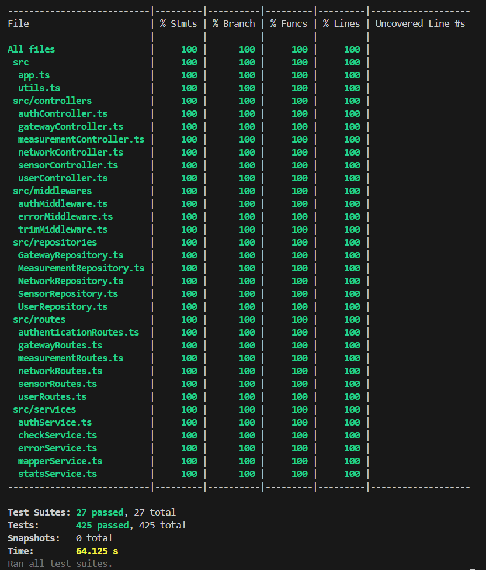

# Test Report

# Contents

- [Test Report](#test-report)
- [Contents](#contents)
- [Dependency graph](#dependency-graph)
- [Integration approach](#integration-approach)
- [Tests](#tests)
- [Coverage](#coverage)
  - [Coverage of FR](#coverage-of-fr)
  - [Coverage white box](#coverage-white-box)

# Dependency graph

# Integration approach
Tutti i test seguenti sono stati effettuati usando SQLite in memory come DB, e jest.mock per l'integrazione incrementale.
In breve:
- Siamo partiti dallo unit testing BB per ogni Repository, usando il DB in memory.
- Poi abbiamo integrato usando i mock, i controller con gli eventuali service.
- Dopodiché abbiamo integrato, sempre usando i mock, le rotte che chiamano i controller, con eventuali service.
- Infine abbiamo testato le rotte per intero con test e2e.

## Network

Bottom-up

- Step1: NetworkRepository
- Step2: NetworkRepository + NetworkController + mapperService
- Step3: NetworkRepository + NetworkController + mapperService + NetworkRoutes
- Step3: NetworkRepository + NetworkController + mapperService + NetworkRoutes + Network (E2E)

## Gateways

Bottom-up

- Step1: GatewayRepository (unit testing)
- Step2: GatewayRepository + GatewayController
- Step3: GatewayRepository + GatewayController + mapperService
- Step4: GatewayRepository + GatewayController + mapperService + checkService
- Step5: GatewayRepository + GatewayController + mapperService + checkService + GatewayRoutes

## Sensors

Bottom-up

- Step1: SensorRepository
- Step2: SensorRepository + SensorController + checkService
- Step3: SensorRepository + SensorController + checkService + mapperService + SensorRoutes

## Measurement

Bottom-up

- Step1: MeasurementRepository
- Step2: MeasurementRepository + SensorController
- Step3: MeasurementRepository + MeasurementController + Measurement (E2E) +MeasurementRoutes
- Step4: MeasurementRepository + MeasurementController + Measurement (E2E) +MeasurementRoutes + StatsService

# Tests

Sono stati esclusi dalle tabelle i test non scritti da noi.

Tra parentesi vicino ad ogni tecnica è segnato il numero di test case che usano tale tecnica.

## Auth
| Test case name | Object(s) tested | Test level | Technique used |
| :------------ | :--------------: | :--------: | :------------: |
| TS1: authenticateUser() | **authMiddleware** | Unit | WB/ coverage (4) |
| TS1: getToken() | **authController** | Integration | WB/ coverage (3) |
| TS1: GET /auth | **AuthRoutes** | E2E | WB/ coverage (3) |

## Users
| Test case name | Object(s) tested | Test level | Technique used |
| :------------ | :--------------: | :--------: | :------------: |
| TS1: createUser() | **userController** | Integration | WB/ coverage (2) |
| TS2: deleteUser() | **userController** | Integration | WB/ coverage (2) |
| TS1: GET /users | **UserRoutes** | E2E | WB/ coverage (5) |
| TS2: POST /users | **UserRoutes** | E2E | WB/ coverage (2) |
| TS3: GET /users/:userName | **UserRoutes** | E2E | WB/ coverage (2) |
| TS4: DELETE /users/:userName | **UserRoutes** | E2E | WB/ coverage (2) |

## Networks

| Test case name               |   Object(s) tested    | Test level  |               Technique used               |
| :--------------------------- | :-------------------: | :---------: | :----------------------------------------: |
| TN1: createNetwork()         | **NetworkRepository** |    Unit     |          BB/ Eq Partitioning (2)           |
| TN2: getNetworkByCode()      | **NetworkRepository** |    Unit     | BB/ Eq Partitioning (2),  BB/ Boundary (1) |
| TN3: getAllNetwork()         | **NetworkRepository** |    Unit     |          BB/ Eq Partitioning (2)           |
| TN4: updateNetwork()         | **NetworkRepository** |    Unit     | BB/ Eq Partitioning (4),  BB/ Boundary (1) |
| TN5: deleteNetwork()         | **NetworkRepository** |    Unit     | BB/ Eq Partitioning (2),  BB/ Boundary (1) |
| TNC1: createNetwork()        | **NetworkController** | Integration | BB/ Eq Partitioning (2),  BB/ Boundary (1) |
| TNC2: getNetwork()           | **NetworkController** | Integration | BB/ Eq Partitioning (2),  BB/ Boundary (1) |
| TNC3: getAllNetworks()       | **NetworkController** | Integration |          BB/ Eq Partitioning (2)           |
| TNC4: updateNetwork()        | **NetworkController** | Integration | BB/ Eq Partitioning (4),  BB/ Boundary (1) |
| TNC5: deleteNetwork()        | **NetworkController** | Integration | BB/ Eq Partitioning (2),  BB/ Boundary (1) |
| TNR1: POST /networks         |   **NetworkRoutes**   | Integration |          BB/ Eq Partitioning (4)           |
| TNR2: GET /networks/:code    |   **NetworkRoutes**   | Integration |          BB/ Eq Partitioning (3)           |
| TNR3: GET /networks          |   **NetworkRoutes**   | Integration |          BB/ Eq Partitioning (2)           |
| TNR4: PATCH /networks/:code  |   **NetworkRoutes**   | Integration |          BB/ Eq Partitioning (2)           |
| TNR5: DELETE /networks/:code |   **NetworkRoutes**   | Integration |          BB/ Eq Partitioning (2)           |
| TNE1: POST /networks         |   **Network (E2E)**   |     E2E     |          BB/ Eq Partitioning (4)           |
| TNE2: GET /networks/:code    |   **Network (E2E)**   |     E2E     |          BB/ Eq Partitioning (3)           |
| TNE3: GET /networks          |   **Network (E2E)**   |     E2E     |          BB/ Eq Partitioning (2)           |
| TNE4: PATCH /networks/:code  |   **Network (E2E)**   |     E2E     |          BB/ Eq Partitioning (4)           |
| TNE5: DELETE /networks/:code |   **Network (E2E)**   |     E2E     |          BB/ Eq Partitioning (4)           |

## Gateways

| Test case name                                          |   Object(s) tested    | Test level  |                Technique used                 |
| :------------------------------------------------------ | :-------------------: | :---------: | :-------------------------------------------: |
| TS1: createGateway()                                    | **GatewayRepository** |    Unit     |              BB/ Eq Partitioning              |
| TS2: getAllGateway()                                    | **GatewayRepository** |    Unit     |              BB/ Eq Partitioning              |
| TS3: getGatewayByMacAddress()                           | **GatewayRepository** |    Unit     | BB/ Eq Partitioning (4),  BB/ Boundary (1) |
| TS4: updateGateway()                                    | **GatewayRepository** |    Unit     |              BB/ Eq Partitioning              |
| TS5: deleteGateway()                                    | **GatewayRepository** |    Unit     | BB/ Eq Partitioning (3),  BB/ Boundary (1) |
| TS6: testGatewayExistance()                             | **GatewayRepository** |    Unit     | BB/ Eq Partitioning (2),  BB/ Boundary (2) |
| TS1: getAllGateway()                                    | **GatewayController** | Integration |              BB/ Eq Partitioning              |
| TS2: createGateway()                                    | **GatewayController** | Integration |              BB/ Eq Partitioning              |
| TS3: getGatewayByMacAddress()                           | **GatewayController** | Integration |              BB/ Eq Partitioning              |
| TS4: deleteGateway()                                    | **GatewayController** | Integration |              BB/ Eq Partitioning              |
| TS5: updateGateway()                                    | **GatewayController** | Integration |              BB/ Eq Partitioning              |
| TS1: getAllGateway()                                    |   **GatewayRoutes**   | Integration |              BB/ Eq Partitioning              |
| TS2: createGateway()                                    |   **GatewayRoutes**   | Integration |              BB/ Eq Partitioning              |
| TS3: getGatewayByMacAddress()                           |   **GatewayRoutes**   | Integration |              BB/ Eq Partitioning              |
| TS4: updateGateway()                                    |   **GatewayRoutes**   | Integration |              BB/ Eq Partitioning              |
| TS5: deleteGateway()                                    |   **GatewayRoutes**   | Integration |              BB/ Eq Partitioning              |
| TS1: GET /networks/:networkCode/gateways                |   **Gateway (E2E)**   |     E2E     | BB/ Eq Partitioning (2),  BB/ Boundary (1) |
| TS2: POST /networks/:networkCode/gateways               |   **Gateway (E2E)**   |     E2E     | BB/ Eq Partitioning (6),  BB/ Boundary (3) |
| TS3: GET /networks/:networkCode/gateways/:gatewayMac    |   **Gateway (E2E)**   |     E2E     | BB/ Eq Partitioning (4),  BB/ Boundary (2) |
| TS4: PATCH /networks/:networkCode/gateways/:gatewayMac  |   **Gateway (E2E)**   |     E2E     | BB/ Eq Partitioning (9),  BB/ Boundary (4) |
| TS5: DELETE /networks/:networkCode/gateways/:gatewayMac |   **Gateway (E2E)**   |     E2E     | BB/ Eq Partitioning (6),  BB/ Boundary (2) |

## Sensors

| Test case name                                                             |   Object(s) tested   | Test level  |                 Technique used                 |
| :------------------------------------------------------------------------- | :------------------: | :---------: | :--------------------------------------------: |
| TS1: createSensor()                                                        | **SensorRepository** |    Unit     |              BB/ Eq Partitioning               |
| TS2: getAllSensors()                                                       | **SensorRepository** |    Unit     | BB/ Eq Partitioning (4),  BB/ Boundary (2)  |
| TS3: getSensorByMacAddress()                                               | **SensorRepository** |    Unit     | BB/ Eq Partitioning (6),  BB/ Boundary (3)  |
| TS4: updateSensor()                                                        | **SensorRepository** |    Unit     |              BB/ Eq Partitioning               |
| TS5: deleteSensor()                                                        | **SensorRepository** |    Unit     | BB/ Eq Partitioning (6),  BB/ Boundary (3)  |
| TS6: testSensorExistance()                                                 | **SensorRepository** |    Unit     | BB/ Eq Partitioning (2),  BB/ Boundary (2)  |
| ------------------------                                                   |          -           |      -      |                       -                        |
| TS1: createSensor()                                                        | **sensorController** | Integration | BB/ Eq Partitioning (2),  BB/ Boundary (1)  |
| TS2: getAllSensors()                                                       | **sensorController** | Integration | BB/ Eq Partitioning (4),  BB/ Boundary (4)  |
| TS3: getSensorByMacAddress()                                               | **sensorController** | Integration | BB/ Eq Partitioning (6),  BB/ Boundary (3)  |
| TS4: updateSensor()                                                        | **sensorController** | Integration | BB/ Eq Partitioning (5),  BB/ Boundary (1)  |
| TS5: deleteSensor()                                                        | **sensorController** | Integration | BB/ Eq Partitioning (6),  BB/ Boundary (3)  |
| ------------------------                                                   |          -           |      -      |                       -                        |
| TS1: GET /networks/:networkCode/gateways/:gatewayMac/sensors               |   **sensorRoutes**   |  API (e2e)  | BB/ Eq Partitioning (4),  BB/ Boundary (2)  |
| TS2: POST /networks/:networkCode/gateways/:gatewayMac/sensors              |   **sensorRoutes**   |  API (e2e)  | BB/ Eq Partitioning (5),  BB/ Boundary (5)  |
| TS3: GET /networks/:networkCode/gateways/:gatewayMac/sensors/:sensorMac    |   **sensorRoutes**   |  API (e2e)  | BB/ Eq Partitioning (6),  BB/ Boundary (5)  |
| TS4: PATCH /networks/:networkCode/gateways/:gatewayMac/sensors/:sensorMac  |   **sensorRoutes**   |  API (e2e)  | BB/ Eq Partitioning (8),  BB/ Boundary (5)  |
| TS5: DELETE /networks/:networkCode/gateways/:gatewayMac/sensors/:sensorMac |   **sensorRoutes**   |  API (e2e)  | BB/ Eq Partitioning (6),  BB/ Boundary (5)  |

## Measurement

| Test case name                                                                        |     Object(s) tested      | Test level  |                Technique used                 |
| :------------------------------------------------------------------------------------ | :-----------------------: | :---------: | :-------------------------------------------: |
| TS1: createMeasurement()                                                              | **MeasurementRepository** |    Unit     | BB/ Eq Partitioning (5),  BB/ Boundary (2) |
| TS2: getAllMeasurement()                                                              | **MeasurementRepository** |    Unit     |            BB/ Eq Partitioning (2)            |
| ------------------------                                                              |             -             |      -      |                       -                       |
| TS1: createMeasurement()                                                              | **measurementController** | Integration | BB/ Eq Partitioning (4),  BB/ Boundary (2) |
| TS2: getMeasurementsBySensorSet()                                                     | **measurementController** | Integration | BB/ Eq Partitioning (5),  BB/ Boundary (1) |
| TS3: getMeasurementsBySensor()                                                        | **measurementController** | Integration | BB/ Eq Partitioning (5),  BB/ Boundary (2) |
| TS4: getAllMeasurements()                                                             | **measurementController** | Integration |            BB/ Eq Partitioning (2)            |
| TS5: getStatsBySensorSet()                                                            | **measurementController** | Integration | BB/ Eq Partitioning (3),  BB/ Boundary (1) |
| TS6: getOutliersBySensorSet()                                                         | **measurementController** | Integration | BB/ Eq Partitioning (3),  BB/ Boundary (1) |
| TS7: getStatsBySensor()                                                               | **measurementController** | Integration | BB/ Eq Partitioning (2),  BB/ Boundary (1) |
| TS8: getOutliersBySensor()                                                            | **measurementController** | Integration | BB/ Eq Partitioning (2),  BB/ Boundary (1) |
| ------------------------                                                              |             -             |      -      |                       -                       |
| TS1: POST /networks/:networkCode/gateways/:gatewayMac/sensors/:sensorMac/measurements |   **measurementRoutes**   |  API (e2e)  | BB/ Eq Partitioning (9),  BB/ Boundary (2) |
| TS2: GET /networks/:networkCode/gateways/:gatewayMac/sensors/:sensorMac/measurements  |   **measurementRoutes**   |  API (e2e)  | BB/ Eq Partitioning (6),  BB/ Boundary (2) |
| TS3: GET /networks/:networkCode/gateways/:gatewayMac/sensors/:sensorMac/stats         |   **measurementRoutes**   |  API (e2e)  | BB/ Eq Partitioning (3),  BB/ Boundary (2) |
| TS4: GET /networks/:networkCode/gateways/:gatewayMac/sensors/:sensorMac/outliers      |   **measurementRoutes**   |  API (e2e)  | BB/ Eq Partitioning (2),  BB/ Boundary (1) |
| TS5: GET /networks/:networkCode/measurements                                          |   **measurementRoutes**   |  API (e2e)  | BB/ Eq Partitioning (5),  BB/ Boundary (2) |
| TS6: GET /networks/:networkCode/stats                                                 |   **measurementRoutes**   |  API (e2e)  | BB/ Eq Partitioning (3),  BB/ Boundary (1) |
| TS7: GET /networks/:networkCode/outliers                                              |   **measurementRoutes**   |  API (e2e)  | BB/ Eq Partitioning (2),  BB/ Boundary (1) |

## Others
| Test case name | Object(s) tested | Test level | Technique used |
| :----------------------------: | :-------------: | :---------: | :---------------: |
| src/utils.ts | src/utils.ts | Integration | WB/ coverage |
| src/services/authService.ts |src/services/authService.ts| Integration | WB/ coverage |
| src/services/errorService.ts | src/services/errorService.ts| Integration | WB/ coverage |

## Coverage of FR

| Functional Requirement or scenario                                     | Test(s)                                                                                                                                                                                                                                                                                                                                                                                                                                        |
| ---------------------------------------------------------------------- | ---------------------------------------------------------------------------------------------------------------------------------------------------------------------------------------------------------------------------------------------------------------------------------------------------------------------------------------------------------------------------------------------------------------------------------------------- |
| _FR1 Authentication_                                                   |                                                                                                                                                                                                                                                                                                                                                                                                                                                |
| FR1.1 Authenticate user                                                | AuthController.integration.test → TS1: AuthController big-bang integration                                                                                                                                                                                                                                                                                                                                                                     |
| _FR2 Manage users_                                                     |                                                                                                                                                                                                                                                                                                                                                                                                                                                |
| FR2.1 Retrieve all users                                               | UserRepository.db.test → TS1: getAllUsers   UserRepository.mock.test → TS1: getAllUsers   UserRoutes.integration.test → TS1: get all users   Users.e2e.test → T1: GET all users                                                                                                                                                                                                                                                       |
| FR2.2 Create a new user                                                | UserRepository.db.test → TS2: createUser   UserRepository.mock.test → TS2: createUser   UserController2.integration.test → TS1: createUser()   Users.e2e.test → T2: POST create a user                                                                                                                                                                                                                                                |
| FR2.3 Retrieve a specific user                                         | UserRepository.db.test → TS3: getUserByUsername   UserRepository.mock.test → TS3: getUserByUsername   UserController.integration.test → TS1: getUser   Users.e2e.test → T3: GET a user                                                                                                                                                                                                                                                |
| FR2.4 Delete a specific user                                           | UserRepository.db.test → TS4: deleteUser   UserRepository.mock.test → TS4: deleteUser   UserController2.integration.test → TS2: deleteUser()   Users.e2e.test → T4: DELETE a user                                                                                                                                                                                                                                                     |
| _FR3 Manage networks_                                                  |                                                                                                                                                                                                                                                                                                                                                                                                                                                |
| FR3.1 Retrieve all networks                                            | NetworkRepository.db.test → TN3: GetAllNetworks   NetworkController.integration.test → TNC3: get All Networks   NetworkRoutes.integration.test → TNR3: get all networks   Network.e2e.test → TNE3: GET all networks                                                                                                                                                                                                                   |
| FR3.2 Create a new network                                             | NetworkRepository.db.test → TN1: Create Network   NetworkController.integration.test → TNC1: Create Network   NetworkRoutes.integration.test → TNR1: create network   Network.e2e.test → TNE1: POST create a network                                                                                                                                                                                                                  |
| FR3.3 Retrieve a specific network                                      | NetworkRepository.db.test → TN2: Get Network by Code   NetworkController.integration.test → TNC2: get Network   NetworkRoutes.integration.test → TNR2: get network by code   Network.e2e.test → TNE2: GET a network                                                                                                                                                                                                                   |
| FR3.4 Update a network                                                 | NetworkRepository.db.test → TN4: Update Network   NetworkController.integration.test → TNC4: Update Network   NetworkRoutes.integration.test → TNR4: update network   Network.e2e.test → TNE4: PATCH update a network                                                                                                                                                                                                                 |
| FR3.5 Delete a specific network                                        | NetworkRepository.db.test → TN5: Delete Network   NetworkController.integration.test → TNC5: Delete Network   NetworkRoutes.integration.test → TNR5: delete network   Network.e2e.test → TNE5: DELETE a network                                                                                                                                                                                                                       |
| _FR4 Manage gateways_                                                  |                                                                                                                                                                                                                                                                                                                                                                                                                                                |
| FR4.1 Retrieve all gateways of a network                               | GatewayRepository.db.test → TS2: getAllGateway()   GatewayController.integration.repo.test.ts → TS1: getAllGateway()   GatewayController.integration.mapper.test → TS1: getAllGateway()   GatewayController.integration.check.test → TS1: getAllGateway()   GatewayRoutes.integration.test → TS1: getAllGateway()   Gateways.e2e.test → TS1: GET all gateways                                                                   |
| FR4.2 Create a new gateway for a network                               | GatewayRepository.db.test → TS1: createGateway()   GatewayRepository.db.test → TS6: testGatewayExistance()   GatewayController.integration.repo.test.ts → TS2: createGateway()   GatewayController.integration.mapper.test → TS2: createGateway()   GatewayController.integration.check.test → TS2: createGateway()   GatewayRoutes.integration.test → TS2: createGateway()   Gateways.e2e.test → TS2: POST create a gateway |
| FR4.3 Retrieve a specific gateway                                      | GatewayRepository.db.test → TS3: getGatewayByMacAddress()   GatewayController.integration.repo.test.ts → TS3: getGatewayByMacAddress()   GatewayController.integration.mapper.test → TS3: getGatewayByMacAddress()   GatewayController.integration.check.test → TS3: getGatewayByMacAddress()   GatewayRoutes.integration.test → TS3: getGatewayByMacAddress()   Gateways.e2e.test → TS3: GET a gateway                         |
| FR4.4 Update a gateway                                                 | GatewayRepository.db.test → TS4: updateGateway()   GatewayRepository.db.test → TS6: testGatewayExistance()   GatewayController.integration.repo.test.ts → TS5: updateGateway()   GatewayController.integration.mapper.test → TS4: updateGateway()   GatewayController.integration.check.test → TS4: updateGateway()   GatewayRoutes.integration.test → TS4: updateGateway()   Gateways.e2e.test → TS4: PATCH a gateway       |
| FR4.5 Delete a specific gateway                                        | GatewayRepository.db.test → TS5: deleteGateway()   GatewayController.integration.repo.test.ts → TS4: deleteGateway()   GatewayController.integration.mapper.test → TS5: deleteGateway()   GatewayController.integration.check.test → TS5: deleteGateway()   GatewayRoutes.integration.test → TS5: deleteGateway()   Gateways.e2e.test → TS5: DELETE a gateway                                                                   |
| _FR5 Manage sensors_                                                   |                                                                                                                                                                                                                                                                                                                                                                                                                                                |
| FR5.1 Retrieve all sensors of a gateway                                | SensorRepository.db.test → TS2: getAllSensors()   SensorController.integration.test → TS2: getAllSensors()   Sensors.e2e.test → TS1: GET all sensors                                                                                                                                                                                                                                                                                     |
| FR5.2 Create a new sensor for a gateway                                | SensorRepository.db.test → TS1: createSensor()   SensorRepository.db.test → TS6: testSensorExistance()   SensorController.integration.test → TS1: createSensor()   Sensors.e2e.test → TS2: POST create a sensor                                                                                                                                                                                                                       |
| FR5.3 Retrieve a specific sensor                                       | SensorRepository.db.test → TS3: getSensorByMacAddress()   SensorController.integration.test → TS3: getSensorByMacAddress()   Sensors.e2e.test → TS3: GET a sensor                                                                                                                                                                                                                                                                        |
| FR5.4 Update a sensor                                                  | SensorRepository.db.test → TS4: updateSensor()   SensorRepository.db.test → TS6: testSensorExistance()   SensorController.integration.test → TS4: updateSensor()   Sensors.e2e.test → TS4: PATCH a sensor                                                                                                                                                                                                                             |
| FR5.5 Delete a specific sensor                                         | SensorRepository.db.test → TS5: deleteSensor()   SensorController.integration.test → TS5: deleteSensor()   Sensors.e2e.test → TS5: DELETE a sensor                                                                                                                                                                                                                                                                                       |
| _FR6 Manage measurements_                                              |                                                                                                                                                                                                                                                                                                                                                                                                                                                |
| FR6.1 Retrieve measurements for a set of sensors of a specific network | MeasurementController.integration.test → TS2: getMeasurementsBySensorSet()   Measurement.e2e.test → TS5: GET /networks/:networkCode/measurements                                                                                                                                                                                                                                                                                            |
| FR6.2 Retrieve statistics for a set of sensors of a specific network   | MeasurementController.integration.test → TS5: getStatsBySensorSet()   StatsServices.test → TS1: calculateStats()   Measurement.e2e.test → TS6: GET /networks/:networkCode/stats                                                                                                                                                                                                                                                          |
| FR6.3 Retrieve outliers for a set of sensors of a specific network     | MeasurementController.integration.test → TS6: getOutliersBySensorSet()   Measurement.e2e.test → TS7: GET /networks/:networkCode/outliers                                                                                                                                                                                                                                                                                                    |
| FR6.4 Store measurements for a specific sensor                         | MeasurementRepository.db.test → TS1: createMeasurement()   MeasurementController.integration.test → TS1: createMeasurement()   Measurement.e2e.test → TS1: POST /networks/:networkCode/gateways/:gatewayMac/sensors/:sensorMac/measurements                                                                                                                                                                                              |
| FR6.5 Retrieve measurements for a specific sensor                      | MeasurementRepository.db.test → TS2: getAllMeasurement()   MeasurementController.integration.test → TS3: getMeasurementsBySensor()   StatsServices.test → TS2: getFilteredMeasurements()   Measurement.e2e.test → TS2: GET /networks/:networkCode/gateways/:gatewayMac/sensors/:sensorMac/measurements                                                                                                                                |
| FR6.6 Retrieve statistics for a specific sensor                        | MeasurementController.integration.test → TS7: getStatsBySensor()   Measurement.e2e.test → TS3: GET /networks/:networkCode/gateways/:gatewayMac/sensors/:sensorMac/stats                                                                                                                                                                                                                                                                     |
| FR6.7 Retrieve outliers for a specific sensor                          | MeasurementController.integration.test → TS8: getOutliersBySensor()   Measurement.e2e.test → TS4: GET /networks/:networkCode/gateways/:gatewayMac/sensors/:sensorMac/outliers                                                                                                                                                                                                                                                               |

## Coverage white box

Purtroppo non siamo riusciti ad ottenere il 100% ovunque, ma comunque abbiamo ottenuto un buon 99.64% degli statement. Le righe che Jest segnala come non coperte, secondo noi, sono coperte da casi aggiuntivi che abbiamo scritto, ma secondo Jest non lo sono comunque.
Le 5 righe scoperte sono:
- utils.ts: due operatori ternari nel caso di parsificazione di query params.
- networkRoutes.ts: il catch dell'errore nel caso di getAllNetworks, che dovrebbe essere coperto dal "TNR3.3: 500 InternalServerError" in cui mockiamo la funzione del controller di modo che lanci un Error.
- userRoutes.ts: il catch dell'errore nel caso di getAllUsers, allo stesso modo del precedente.
- errorService.ts: operatore ternario che logga lo stacktrace, anche questo dovrebbe essere coperto da "createAppError: Error 500 with stacktrace" in `others.test.ts`